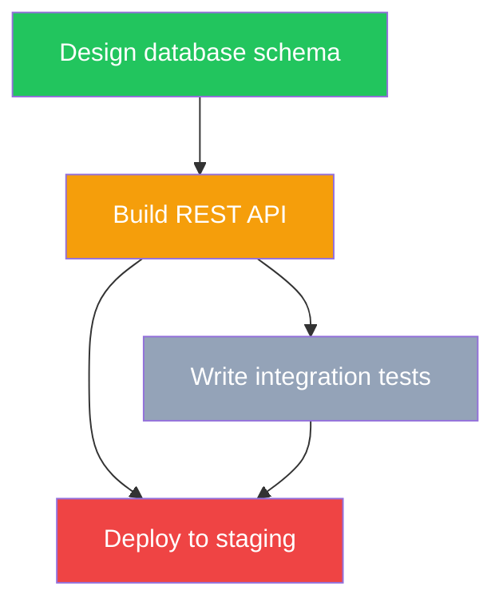

<div align="center">

# ARCS

**Agent Routing & Context System**

[](https://www.npmjs.com/package/@rryando/arcs)
[](https://github.com/rryando/arcs/actions/workflows/ci.yml)
[](https://nodejs.org/)
[](https://www.typescriptlang.org/)
[](LICENSE)

*Stop re-explaining your project to the AI every session.*

</div>

---

Your AI coding agent is stateless. Every session, it scans the codebase from scratch, forgets what failed last time, and has no idea which task is safe to start. **ARCS is the durable memory that fixes that.**

It's a CLI-native tool that gives agents a persistent, queryable project **DAG** — with real dependency semantics. An agent calls `arcs brief` and gets back an *operating brief*: what to work on, what's blocked, what was decided, and what already broke — in a single ~1 KB JSON envelope, with zero source files read. Work happens, results flow back into the graph, and the next session starts from context instead of a blank slate.

> **arcs** `/ɑːrks/` — directed edges in graph theory. Also: **A**gent **R**outing & **C**ontext **S**ystem.

---

## Before / After

A normal session vs. a session with ARCS:

| | Without ARCS | With ARCS |
|---|---|---|
| **Orientation** | Re-scan the repo, re-read files, re-derive the architecture | `arcs brief` → operating brief in ~1 KB |
| **Picking work** | Guess what's next; trip over half-finished dependencies | `arcs next` → first task whose deps are *all* satisfied |
| **Prior knowledge** | Re-discover the same gotcha you hit last week | Related knowledge surfaces alongside the task |
| **Finishing** | Result evaporates when the session ends | `arcs done` unblocks dependents; `arcs remember` captures the lesson |

The DAG is the shared, durable memory *between* otherwise-disconnected agent sessions. The knowledge base only compounds — instead of re-deriving — when entries are substantive **and** read before work. ARCS enforces both (see [Knowledge Depth](#knowledge-depth)).

---

## Three Surfaces

ARCS persists everything onto three surfaces, plus a dependency graph and auto-generated Mermaid diagrams that tie them together.

| Surface | Storage | What it holds |
|---------|---------|---------------|
| **Queue** | `tasks/index.json` (rendered to `tasks.md`) | Immediate work items, ordered by `dependsOn` edges |
| **Plan** | `plans/*.md` + `.diagram.mmd` | Durable multi-step change records with Mermaid execution maps |
| **Memory** | `knowledge/*.md` | Reusable discoveries: gotchas, lessons, patterns, architecture, decisions |

Dependency-aware selection runs across all three: `arcs next` returns the next unblocked task, and `arcs diagram ready` returns the unblocked nodes of a plan's execution map.

---

## Quick Start

**1. Install**

```bash
npm install -g @rryando/arcs
arcs init
```

`arcs init` runs an interactive setup wizard that:
- Detects **OpenCode** and/or **Claude Code** on your PATH
- Lets you pick which platform(s) to configure
- Selects heavy / standard / light model tiers from your authenticated providers
- Deploys the ARCS agent + skill bundle to the right config directories

**2. Onboard a project**

```bash
cd your-project
```

Open OpenCode (or Claude Code), select the **ARCS Orchestrator** agent, and ask it to initialize. It scans the repo and populates the DAG — overview, tasks, plans, and an initial pass of structural knowledge.


**3. Use it — by hand or via the orchestrator**

```bash
arcs brief              # What should I work on? (operating brief)
arcs next               # Next dependency-safe task + related knowledge
arcs done <taskId>      # Mark complete, unblock dependents
arcs remember "..."     # Capture what you learned
```

Or hand the loop to the **ARCS Orchestrator** for full automation.

---

## Prerequisites

| Tool | Required | Notes |
|------|----------|-------|
| [Node.js](https://nodejs.org/) 20+ | Yes | Runtime |
| [OpenCode](https://opencode.ai/) | Recommended | Agent host — orchestrator + sub-agents |
| [Claude Code](https://claude.ai/code) | Recommended | Alternative agent host; `arcs init` deploys the sub-agents with full model-tier selection |
| [codegraph](https://github.com/colbymchenry/codegraph) | Optional | Per-project code-intelligence index, queried via MCP; degrades gracefully when absent |
| [rtk](https://github.com/rtk-ai/rtk) | Optional | Token-optimized command proxy; auto-wired into both hosts when present |

ARCS itself is **CLI-only** — pure TypeScript, no MCP server, no preview server. The optional tools above are about the agent *host*, not ARCS.

---

## How It Works

### The core loop

```
arcs next  →  [agent works]  →  arcs done <id>  →  arcs remember "..."
     │                              │                      │
     │ first task whose             │ completes task,      │ captures durable
     │ dependencies are             │ unblocks dependents  │ knowledge for
     │ ALL satisfied                │                      │ future sessions
     ▼                              ▼                      ▼
┌─────────────────────────────────────────────────────────────────┐
│                    ~/.arcs/projects/{slug}/                      │
│                                                                  │
│  tasks/index.json ──dependsOn──→ topological sort → next task   │
│  knowledge/       ──BM25+graph──→ related context               │
│  plans/           ──diagram.mmd──→ execution map                │
└─────────────────────────────────────────────────────────────────┘
```

### Task dependencies — the actual DAG

Tasks declare dependencies. ARCS enforces acyclicity and uses topological sort to decide execution order:

```bash
arcs task create myapp "Design database schema" --priority=high
arcs task create myapp "Build REST API" --dependsOn=design-database-schema
arcs task create myapp "Write integration tests" --dependsOn=build-rest-api
arcs task create myapp "Deploy to staging" --dependsOn=build-rest-api,write-integration-tests
```



`arcs next` returns **"Write integration tests"** — the first task whose dependencies are all done. "Deploy to staging" stays blocked until it is. Priority is only a tiebreaker *within* the same topological level, never the primary sort.

### The operating brief (`arcs brief`)

```bash
$ arcs brief --lean --json
```

```json
{
  "slug": "my-project",
  "name": "My Project",
  "operatingBrief": {
    "currentFocus": "Build REST API",
    "recommendedSurface": "QUEUE",
    "why": "Task in progress: Build REST API",
    "nextAction": "Continue task build-rest-api"
  },
  "openTasksCount": 3,
  "topOpenTasks": [
    { "id": "build-rest-api", "title": "Build REST API", "status": "in_progress" },
    { "id": "write-integration-tests", "title": "Write integration tests", "status": "backlog" }
  ]
}
```

~1 KB, no source files read. `recommendedSurface` (QUEUE / PLAN / MEMORY) tells the agent which workflow branch to take. `brief` also reports a `knowledgeHealth` line (`{ total, thin, stale }`) so an under-maintained knowledge base is visible right at orientation.

---

## The Agent Bundle

ARCS ships an OpenCode / Claude Code bundle: a **delegation-first orchestrator**, **8 typed sub-agents**, and **15 skills**, deployed via `arcs deploy-superpowers` (or wired automatically by `arcs init`).

### The orchestrator

It never reads code, runs tests, or explores directly — it routes. It also holds its own operating values rather than only delegating them:

- **`the-ladder`** — minimalism applies to orchestration itself. The cheapest rung that answers the need wins: *answer from context → one `arcs` CLI call → `graph-explorer` → typed agent*, with the fewest tasks and smallest disjoint scope per dispatch.
- **`devil-advocate`** — every plan, dispatch, and "done" is challenged *before* the formal gate ("what breaks without this? who's actually blocked? can fewer agents do it?"); the gate then merely confirms.
- **confidence-to-orchestrate** — it never dispatches on a guess. Ambiguity is resolved cheaply from the DAG first, then residual unknowns go to the user as batched questions — and it stops asking the moment it can state the goal and "done" in one sentence.

A **read-first knowledge protocol** runs throughout: prior knowledge is read before every non-mechanical dispatch, and durable insight is captured at fan-in via idempotent `arcs knowledge upsert` — so the DAG compounds instead of duplicating.

### Sub-agents

Each has a sharp niche; survivors carry explicit modes. The orchestrator dispatches them with self-contained scoped prompts (SCOPE / GOAL / CONTEXT / IDS / CONSTRAINTS / SKILL / VERIFY / RETURN) and consumes their structured, non-prose output.

| Sub-agent | Role |
|-----------|------|
| **graph-explorer** | DAG-first + codegraph-MCP exploration — "where is X / what depends on Y" |
| **software-engineer** | Writes code; verifies only the files it touched |
| **tech-architect** | Deep structural analysis, refactor guidance, trade-off evaluation |
| **oncall-ops** | Debugging, log triage, bisect, root-cause analysis |
| **code-reviewer** | Read-only review — reactive diff/PR review **and** proactive convention/architecture audit |
| **devil-advocate** | Adversarial KISS/YAGNI/DRY gate; its completion gate is the single full-project verification |
| **arcs-docs** | DAG health, plan/knowledge/diagram curation |
| **docs-researcher** | External research and documentation; tech-stack scans |

Every sub-agent opens with the standard return envelope so the orchestrator can parse, not re-read:

```
STATUS: done | blocked | partial
FILES_TOUCHED: src/foo.ts
VERIFY: vitest run test/foo.test.ts → pass
BLOCKED_BY: <only when blocked/partial — evidence>
KNOWLEDGE: none
```

Sub-agents verify only the files they touched. The **devil-advocate completion gate** runs the session's single full-project pass (full suite + `tsc --noEmit`); on a block, the orchestrator re-dispatches scoped fixes and re-gates.

### Skills (loaded per dispatch)

| Category | Skills |
|----------|--------|
| **Work mode** (pick one) | `quick-dev`, `code-agent`, `test-driven-development`, `brainstorming` |
| **Lifecycle** | `writing-plans`, `executing-plans` (sequential or parallel), `writing-knowledge` |
| **Quality** | `requesting-code-review`, `deep-pr-review`, `systematic-debugging` |
| **Discipline** | `the-ladder` (auto-layers under work modes — not a mode you pick) |
| **Tooling** | `to-diagram`, `init-project`, `caveman-commit`, `enriching-codegraph-proposals` |

`the-ladder` climbs to the lowest rung that solves the problem — **YAGNI → standard library → native feature → existing dependency → one line → the minimum that works** — while never simplifying away hard carve-outs (trust-boundary validation, data-loss handling, security, accessibility, anything explicitly requested).

---

## Knowledge Depth

Thin, one-sentence memory doesn't compound. ARCS treats knowledge depth as a first-class concern:

- **Per-kind body templates** — each of the 8 knowledge kinds has a fillable skeleton. Scaffold one with `arcs knowledge template --kind=<kind>`.
- **Write-time guard** — `knowledge create` / `upsert` warn on shallow bodies (and on missing summary or source files) unless you explicitly opt out with `--allow-thin`.
- **`knowledge-health` validator** — `arcs validate <slug> --checks=knowledge-health` flags thin and stale entries; the same counts surface in `arcs brief`.

The throughline: substantive entries, written once and read before work, are what turn the knowledge base into compounding memory rather than a graveyard.

---

## Command Cheat-Sheet

All commands take `--json` for structured output (`{ok, data}` on success, `{ok, code, message}` on error) and `--lean` to strip timestamps and save tokens. Full discovery: `arcs --commands --json`.

### Core loop

| Command | Purpose |
|---------|---------|
| `arcs brief <slug>` | Operating brief — focus + knowledge-health counts |
| `arcs next <slug>` | Next dependency-safe task + related knowledge |
| `arcs done <slug> <taskId>` | Mark complete, unblock dependents |
| `arcs remember <slug> "<text>"` | Capture knowledge (auto-classifies kind) |
| `arcs status <slug>` | Progress across all three surfaces |

### Tasks & plans

| Command | Purpose |
|---------|---------|
| `arcs task create <slug> <title> --dependsOn=id1,id2` | Create a task with dependency edges |
| `arcs task update <slug> <id>` | Update a task (incl. `--dependsOn`) |
| `arcs task transition <slug> <id> <status>` | Move a task through its lifecycle |
| `arcs plan create <slug> <title>` | Create a durable plan record |
| `arcs diagram ready <slug> <planId>` | Get unblocked diagram nodes |

### Knowledge

| Command | Purpose |
|---------|---------|
| `arcs knowledge template --kind=<kind>` | Emit the fillable body skeleton for a kind |
| `arcs knowledge upsert <slug> <title> --kind=<kind>` | Idempotent create-or-update by title — **recommended for agents** |
| `arcs knowledge create <slug> <title> --kind=<kind>` | Create a new entry |
| `arcs knowledge search <slug> "<query>"` | Search the knowledge base |
| `arcs knowledge list <slug>` | List entries |

The 8 knowledge kinds: `lesson`, `gotcha`, `pattern`, `architecture`, `module`, `feature`, `reference`, `decision`. `create` / `upsert` accept `--summary`, `--keywords`, `--body` / `--body-file`, `--source-files`, and `--audience`.

### Project, search & maintenance

| Command | Purpose |
|---------|---------|
| `arcs project init` | Register the current directory as a project |
| `arcs project list` | List tracked projects |
| `arcs project update-doc <slug> <doc> --content="..."` | Update a project doc inline |
| `arcs context <slug>` | Full audience-targeted context assembly |
| `arcs search <slug> "<query>"` | BM25 + graph-scored search across the DAG |
| `arcs related <slug> <id>` | Graph-related entities for a node |
| `arcs validate <slug> --checks=<check>` | Health checks: `all`, `sourcefiles`, `status-drift`, `diagrams`, `agents-md`, `knowledge-health` |
| `arcs batch <slug>` | Apply multiple DAG ops in one call |

### Bundle

| Command | Purpose |
|---------|---------|
| `arcs lint-bundle` | Validate agent/skill bundle integrity |
| `arcs deploy-superpowers` | Deploy the bundle to OpenCode (`~/.config/opencode/`) |
| `arcs deploy-claudecode-superpowers` | Deploy the bundle to Claude Code |

---

## Graph & Retrieval

ARCS builds a weighted relationship graph across every project entity:

| Edge type | Weight | Connects |
|-----------|--------|----------|
| `task_belongs_to_plan` | 1.0 | Task → Plan |
| `task_blocks_task` | 0.95 | Task → Task (from `dependsOn`) |
| `shares_source_file` | 0.9 | Any → Any (co-reference) |
| `knowledge_touches_file` | 0.85 | Knowledge → File |
| `plan_contains_task` | 0.8 | Plan → Task |
| `shares_keywords` | 0.5 | Knowledge → Knowledge |

`arcs search` combines BM25 text scoring with weighted-BFS graph traversal; `arcs next` enriches its result with related knowledge pulled from the graph.

---

## Data Model

```
~/.arcs/
├── meta.json                         # Global registry
└── projects/{slug}/
    ├── meta.json                     # Project metadata + workspace paths
    ├── overview.md                   # Summary + goals
    ├── tasks.md                      # Rendered task queue (human-readable)
    ├── tasks/index.json              # Structured tasks + dependsOn edges
    ├── plans/
    │   ├── {id}.meta.json            # Plan status + keywords
    │   ├── {id}.md                   # Plan body (plans/*.md)
    │   └── {id}.diagram.mmd          # Mermaid execution map
    └── knowledge/
        ├── index.json                # Knowledge index
        ├── {id}.meta.json            # Metadata (kind, audience, sourceFiles)
        └── {id}.md                   # Entry body (knowledge/*.md)
```

---

## Codegraph (optional)

When [codegraph](https://github.com/colbymchenry/codegraph) is on PATH, ARCS builds a per-project index during onboarding and sync, and auto-extracts structural knowledge proposals (god nodes, module clusters, cross-module couplings). The `graph-explorer` sub-agent queries codegraph's MCP tools to answer structural questions — call chains, blast radius, symbol neighborhoods — with near-zero raw file reads. Every codegraph feature degrades gracefully when the binary is absent.

---

## Development

```bash
git clone https://github.com/rryando/arcs.git
cd arcs && npm install && npm run build
```

| Command | Description |
|---------|-------------|
| `npm run build` | Compile TypeScript to `dist/` |
| `npm test` | Run the Vitest suite (900+ tests across 82 files) |
| `npm run typecheck` | Type-check without emit (`tsc --noEmit`) |
| `npm run lint` | Biome lint + format check (`src/`, `test/`) |
| `npm run format` | Rewrite files with Biome formatting |

**Tech stack:** pure TypeScript (ES2022, strict), Node 20+, `zod` (schemas), `@clack/prompts` (interactive setup), `picocolors`; Biome for lint/format, Vitest for tests.

> Tests that touch DAG data must run in an isolated temp directory via the `withTempDataDir()` helper — see [`CLAUDE.md`](CLAUDE.md) for the testing-isolation rule.

### Bundle workflow

```bash
npm run build:opencode-bundle    # Build the agent/skill bundle
arcs lint-bundle                 # Validate bundle integrity
arcs deploy-superpowers          # Deploy to ~/.config/opencode/
```

`deploy-superpowers` merges a small set of keys into `~/.config/opencode/opencode.json` with per-key modes — `overwrite` for plugin registration, `if-absent` for model/preference keys, and deep `merge` for sub-agent definitions. The upshot: **your config is always respected** — model routing seeds on first install but never re-stamps, and JSONC comments are preserved.

---

## License

MIT
