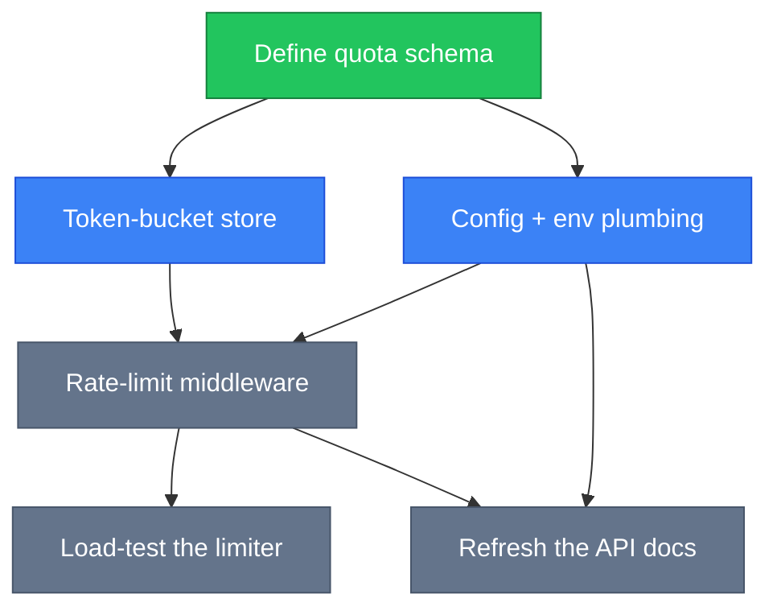

<div align="center">

# ARCS

**Agent Routing & Context System**

[](https://www.npmjs.com/package/@rryando/arcs)
[](https://github.com/rryando/arcs/actions/workflows/ci.yml)
[](https://nodejs.org/)
[](https://www.typescriptlang.org/)
[](LICENSE)

*Stop re-explaining your project to the AI every session.*

</div>

---

Your AI coding agent is stateless. Every session it re-scans the codebase, forgets what failed last week, and has no idea which task is safe to start. **ARCS is the durable memory that fixes that.**

> **arcs** `/ɑːrks/` — directed edges in graph theory. Also: **A**gent **R**outing & **C**ontext **S**ystem.

---

## A graph, not another notes file

Most "agent memory" is a markdown file the agent skims once and then drifts away from. ARCS is a **directed acyclic graph** on disk — real work items joined by real dependency edges — queried and mutated through a CLI.

| Surface | Storage | What it holds |
|---------|---------|---------------|
| **Queue** | `tasks/index.json` (rendered to `tasks.md`) | Immediate work items, ordered by `dependsOn` edges |
| **Plan** | `plans/*.md` + `.diagram.mmd` | Durable multi-step change records with Mermaid execution maps |
| **Memory** | `knowledge/*.md` | Reusable discoveries: gotchas, lessons, patterns, architecture, decisions |

Because the edges are real, the graph answers questions a notes file cannot: *what is safe to start right now*, *what does finishing this unblock*, *what did we already learn about this file*. An agent asks with `arcs brief` and gets an **operating brief** back — roughly 1 KB of JSON, zero source files read.

---

## Why a DAG, and not a scratchpad

Three failure modes show up the moment work outlives a single session:

- **The agent forgets.** Last week's gotcha is gone, so it re-derives — or re-breaks — the same thing.
- **The context window dies mid-task.** Whatever was "in its head" was never written anywhere durable.
- **Parallel agents collide.** Two sub-agents grab work that shares an unfinished dependency and stomp each other.

Real dependency semantics answer all three, because *"what's ready?"* becomes a topological question instead of a judgement call. `arcs next` returns the first task whose dependencies are **all** satisfied; priority is only a tiebreaker *within* a topological level, never the primary sort.

| | Without ARCS | With ARCS |
|---|---|---|
| **Orientation** | Re-scan the repo, re-read files, re-derive the architecture | `arcs brief` → operating brief in ~1 KB |
| **Picking work** | Guess what's next; trip over half-finished dependencies | `arcs next` → first task whose deps are *all* satisfied |
| **Prior knowledge** | Re-discover the same gotcha you hit last week | Related knowledge surfaces alongside the task |
| **Finishing** | Result evaporates when the session ends | `arcs done` unblocks dependents; `arcs remember` captures the lesson |

The graph is the shared, durable memory *between* otherwise-disconnected agent sessions. It only compounds when entries are substantive **and** read before work — ARCS enforces both (see [Knowledge Depth](#knowledge-depth)).

---

## Who it's for, and when it pays off

For anyone driving an AI coding agent — **Claude Code** or **OpenCode** — against a project bigger than one sitting.

It earns its keep when:

- **A feature spans days.** Session four needs to know what sessions one through three decided, and why.
- **You fan work out to sub-agents.** The ready-set tells you which slices are genuinely independent *right now*.
- **Knowledge has to outlive the session.** Gotchas, decisions, and architecture notes belong in a queryable store, not a scrollback buffer.

It is overkill for a throwaway script you will finish in ten minutes.

---

## Where it lives

Local-first: plain files under `~/.arcs`. No server, no database, no account.

```
~/.arcs/
├── meta.json                         # Global registry
└── projects/{slug}/
    ├── meta.json                     # Project metadata + workspace paths
    ├── overview.md                   # Summary + goals
    ├── tasks.md                      # Rendered task queue (human-readable)
    ├── tasks/index.json              # Structured tasks + dependsOn edges
    ├── plans/
    │   ├── {id}.meta.json            # Plan status + keywords
    │   ├── {id}.md                   # Plan body (plans/*.md)
    │   └── {id}.diagram.mmd          # Mermaid execution map
    └── knowledge/
        ├── index.json                # Knowledge index
        ├── {id}.meta.json            # Metadata (kind, audience, sourceFiles)
        └── {id}.md                   # Entry body (knowledge/*.md)
```

ARCS itself is **CLI-only** — pure TypeScript, no MCP server, no preview server. It reaches your agent through a bundle of orchestrators, sub-agents, and skills that `arcs init` deploys into your host's config directory.

| Tool | Required | Notes |
|------|----------|-------|
| [Node.js](https://nodejs.org/) 20+ | Yes | Runtime |
| [OpenCode](https://opencode.ai/) | Recommended | Agent host — orchestrators + sub-agents |
| [Claude Code](https://claude.ai/code) | Recommended | Alternative agent host; `arcs init` deploys the same bundle with full model-tier selection |
| [codegraph](https://github.com/colbymchenry/codegraph) | Optional | Per-project code-intelligence index, queried via MCP; degrades gracefully when absent |
| [rtk](https://github.com/rtk-ai/rtk) | Optional | Token-optimized command proxy; auto-wired into both hosts when present |

---

## How it works

### 1 — Install and onboard

```bash
npm install -g @rryando/arcs
arcs init
```

`arcs init` runs an interactive wizard that detects **OpenCode** and/or **Claude Code** on your PATH, lets you pick which platform(s) to configure, selects heavy / standard / light model tiers from your authenticated providers, and deploys the ARCS agent + skill bundle to the right config directories.

Then, from your project root, open the host, select an ARCS orchestrator, and ask it to initialize. It scans the repo and populates the graph — overview, tasks, plans, and a first pass of structural knowledge.


### 2 — Give the work real edges

```bash
arcs task create myapp "Define quota schema"
arcs task create myapp "Token-bucket store"    --dependsOn=define-quota-schema
arcs task create myapp "Config + env plumbing" --dependsOn=define-quota-schema
arcs task create myapp "Rate-limit middleware" --dependsOn=token-bucket-store,config-env-plumbing
arcs task create myapp "Load-test the limiter" --dependsOn=rate-limit-middleware
arcs task create myapp "Refresh the API docs"  --dependsOn=rate-limit-middleware,config-env-plumbing
```

Task IDs are slugified titles, so edges read like prose. Cycles are rejected at write time.

### 3 — Ask what is ready *now*

Finish the root (`arcs done myapp define-quota-schema`) and the graph partitions itself:



**Green** = done · **blue** = ready (every incoming edge satisfied) · **grey** = blocked by at least one unmet edge. Two nodes are ready at once, so two agents can run in parallel without touching each other's dependencies — while `Rate-limit middleware` waits on *both* parents and `Refresh the API docs` waits on `Rate-limit middleware` **and** `Config + env plumbing`. None of that ordering is a guess:

```bash
$ arcs next myapp --lean --json
```

```json
{
  "ok": true,
  "data": {
    "task": { "id": "token-bucket-store", "title": "Token-bucket store", "status": "backlog", "priority": "medium" },
    "context": "Backlog task ready: Token-bucket store",
    "command": "arcs done myapp token-bucket-store"
  }
}
```

Plans get the same treatment on their Mermaid execution maps: `arcs diagram ready <slug> <planId>` partitions every node into `ready` / `blocked` / `inProgress` / `done`, where `ready` means *backlog **and** every incoming dependency is done*.

### 4 — Work, then write back

```bash
arcs done myapp token-bucket-store           # complete it, unblock dependents
arcs remember myapp "Redis EXPIRE is per-key, not per-hash-field"
arcs knowledge search myapp "rate limit"     # find it again next session
arcs validate myapp --checks=all             # health-check the graph
```

### The operating brief

```bash
$ arcs brief myapp --lean --json
```

```json
{
  "slug": "myapp",
  "name": "MyApp",
  "operatingBrief": {
    "currentFocus": "Token-bucket store",
    "recommendedSurface": "QUEUE",
    "why": "Backlog task ready: Token-bucket store",
    "nextAction": "Start task token-bucket-store"
  },
  "activePlansCount": 0,
  "openTasksCount": 5,
  "topOpenTasks": [{ "id": "token-bucket-store", "title": "Token-bucket store", "status": "backlog" }],
  "knowledgeHealth": { "total": 12, "thin": 1, "stale": 0 }
}
```

~1 KB, no source files read. `recommendedSurface` (QUEUE / PLAN / MEMORY) tells the agent which workflow branch to take, and `knowledgeHealth` makes an under-maintained knowledge base visible right at orientation.

---

## The Agent Bundle

ARCS ships an OpenCode / Claude Code bundle: **three primary orchestrators**, **five typed sub-agents**, and **twelve skills**, deployed via `arcs deploy-superpowers` (or wired automatically by `arcs init`).

### Orchestrators

All three share the same authority, safety invariants, and tool access — they differ only in control flow and narration. `arcs init` installs them side by side; Tab between them in OpenCode.

| Agent | Pick it when |
|-------|--------------|
| **ARCS Orchestrator** (`arcs-orchestrate`) | Default coordinator for direct work, plan execution, one-hop delegation, and DAG writes |
| **ARCS Flash** (`arcs-flash`) | Fast, knowledge-first work with one request-level lookup and compact delegation |
| **ARCS Caveman** (`arcs-orchestrate-caveman`) | You want the same engine with terse narration — a chat-facing overlay that adds zero workflow authority |

Primaries retain direct tools, but **strongly prefer one-hop delegation** for separable outcomes. Each delegated outcome has one owner, and sub-agents cannot delegate again. Tiny work, tightly coupled work, and orchestration-state changes may stay direct; delegation is a routing preference, not a mandatory gate loop.

Flash performs exactly one targeted knowledge search before non-mechanical work, reuses that result for the whole request, skips the lookup for mechanical work, and proceeds immediately when the search is empty. It does not retry the search or repeat it per dispatch.

### Sub-agents

Each has a sharp niche and receives a compact, self-contained dispatch with exactly `GOAL / SCOPE / CONTEXT / VERIFY / STOP`.

| Sub-agent | Role |
|-----------|------|
| **software-engineer** | Implementation or incident diagnosis using `bounded`, `inspect`, or `plan-node` hints |
| **tech-architect** | Read-only `architecture` design or DAG-first cited `research` |
| **graph-explorer** | DAG-first location and dependency questions, with codegraph/source fallback when the DAG cannot answer |
| **code-reviewer** | Read-only `review`, proactive `audit`, or adversarial `risk` analysis |
| **arcs-docs** | Documentation audit and requested updates, including SYNC work |

Every sub-agent returns exactly the compact fields below, with `KNOWLEDGE` added only for a durable finding:

```
STATUS: done | blocked | partial
RESULT: <concise outcome>
FILES: src/foo.ts
VERIFY: vitest run test/foo.test.ts → pass
BLOCKER: <none or concrete evidence>
KNOWLEDGE: <optional durable finding>
```

Verification is proportionate to the outcome and its risk. Review is available when useful, but ordinary work does not require a reviewer-repair chain or completion gate.

### Skills (loaded per dispatch)

The twelve skills are: `implementation`, `test-driven-development`, `systematic-debugging`, `brainstorming`, `writing-plans`, `to-diagram`, `writing-knowledge`, `init-project`, `enriching-codegraph-proposals`, `deep-pr-review`, `caveman-commit`, and `install-claude-code-hook`.

`implementation` handles bounded work, limited inspection, and ready plan-node execution, including dependency checks, relevant verification, and task/diagram alignment through the ARCS CLI. New behavior and bug fixes may add `test-driven-development`; incidents add `systematic-debugging`; material design uncertainty may use `brainstorming` before `writing-plans`. No skill introduces a mandatory review or gate loop. There are no automatic git actions; add, commit, and push require an explicit current-turn user request.

---

## Knowledge Depth

Thin, one-sentence memory doesn't compound. ARCS treats knowledge depth as a first-class concern:

- **Per-kind body templates** — each of the 8 knowledge kinds has a fillable skeleton. Scaffold one with `arcs knowledge template --kind=<kind>`.
- **Write-time guard** — `knowledge create` / `upsert` warn on shallow bodies (and on missing summary or source files) unless you explicitly opt out with `--allow-thin`.
- **`knowledge-health` validator** — `arcs validate <slug> --checks=knowledge-health` flags thin and stale entries; the same counts surface in `arcs brief`.

The throughline: substantive entries, written once and read before work, are what turn the knowledge base into compounding memory rather than a graveyard.

---

## Command Cheat-Sheet

All commands take `--json` for structured output (`{ok, data}` on success, `{ok, code, message}` on error) and `--lean` to strip timestamps and save tokens. Full discovery: `arcs --commands --json`.

### Core loop

| Command | Purpose |
|---------|---------|
| `arcs brief <slug>` | Operating brief — focus + knowledge-health counts |
| `arcs next <slug>` | Next dependency-safe task + related knowledge |
| `arcs done <slug> <taskId>` | Mark complete, unblock dependents |
| `arcs remember <slug> "<text>"` | Capture knowledge (auto-classifies kind) |
| `arcs status <slug>` | Progress across all three surfaces |

### Tasks & plans

| Command | Purpose |
|---------|---------|
| `arcs task create <slug> <title> --dependsOn=id1,id2` | Create a task with dependency edges |
| `arcs task update <slug> <id>` | Update a task (incl. `--dependsOn`) |
| `arcs task transition <slug> <id> <status>` | Move a task through its lifecycle |
| `arcs plan create <slug> <title>` | Create a durable plan record |
| `arcs diagram ready <slug> <planId>` | Partition diagram nodes into ready / blocked / inProgress / done |

### Knowledge

| Command | Purpose |
|---------|---------|
| `arcs knowledge template --kind=<kind>` | Emit the fillable body skeleton for a kind |
| `arcs knowledge upsert <slug> <title> --kind=<kind>` | Idempotent create-or-update by title — **recommended for agents** |
| `arcs knowledge create <slug> <title> --kind=<kind>` | Create a new entry |
| `arcs knowledge search <slug> "<query>"` | Search the knowledge base |
| `arcs knowledge get <slug> <id>` | Read a single entry |
| `arcs knowledge list <slug>` | List entries |

The 8 knowledge kinds: `lesson`, `gotcha`, `pattern`, `architecture`, `module`, `feature`, `reference`, `decision`. `create` / `upsert` accept `--summary`, `--keywords`, `--body` / `--body-file`, `--source-files`, and `--audience`.

### Project, search & maintenance

| Command | Purpose |
|---------|---------|
| `arcs project init` | Register the current directory as a project |
| `arcs project list` | List tracked projects |
| `arcs project update-doc <slug> <doc> --content="..."` | Update a project doc inline |
| `arcs context <slug>` | Full audience-targeted context assembly |
| `arcs search <slug> "<query>"` | BM25 + graph-scored search across the DAG |
| `arcs related <slug> <id>` | Graph-related entities for a node |
| `arcs validate <slug> --checks=<check>` | Health checks: `all`, `sourcefiles`, `status-drift`, `diagrams`, `agents-md`, `knowledge-health` |
| `arcs batch <slug>` | Apply multiple DAG ops in one call |

### Bundle

| Command | Purpose |
|---------|---------|
| `arcs lint-bundle` | Validate agent/skill bundle integrity |
| `arcs deploy-superpowers` | Deploy the bundle to OpenCode (`~/.config/opencode/`) |
| `arcs deploy-claudecode-superpowers` | Deploy the bundle to Claude Code |

---

## Graph & Retrieval

Beyond `dependsOn`, ARCS builds a weighted relationship graph across every project entity:

| Edge type | Weight | Connects |
|-----------|--------|----------|
| `task_belongs_to_plan` | 1.0 | Task → Plan |
| `task_blocks_task` | 0.95 | Task → Task (from `dependsOn`) |
| `shares_source_file` | 0.9 | Any → Any (co-reference) |
| `knowledge_touches_file` | 0.85 | Knowledge → File |
| `plan_contains_task` | 0.8 | Plan → Task |
| `shares_keywords` | 0.5 | Knowledge → Knowledge |

`arcs search` combines BM25 text scoring with weighted-BFS graph traversal; `arcs next` enriches its result with related knowledge pulled from the same graph.

---

## Session Panel — Headless Claude Runs

The web UI's session panel delivers a prompt through one of four modes (the "deliver via" selector):

| Mode | Runtime target | Memory |
|------|----------------|--------|
| **fork via turns** | A new ARCS-owned thread forked from the referenced Claude Code session (`POST /sessions/:id/turns` + `--fork-session`) — ARCS never injects into the live session itself | The fork inherits the session's context; later turns accumulate on the fork's own sidecar |
| **headless resume** | The referenced Claude Code session's runtime thread, resumed headlessly (`--resume`) | The session's thread; **idle sessions only** |
| **headless one-shot** | A fresh `claude -p` against an ARCS-owned `arcs-oneshot-<slug>` record | None — a fresh Claude every call |
| **headless thread** | A persistent ARCS-owned thread (`arcs-thread-<slug>-<uuid4>`), minted once then reused | Accumulates in one sidecar |

Headless runs are **asynchronous by contract**: `POST /sessions/:id/run` answers `202 { accepted: true }` immediately and the job runs out-of-band on the server. The reply is not streamed — it appears in the write-target session's transcript (`GET /sessions/:id/transcript`) when the job finishes, alongside `metadata.run` finalization (outcome, `endedAt`, `replyChars`). Resume additionally mirrors the resumed session's runtime transcript back into the sidecar after the child exits.

Resume targets are **idle-only**: an active Claude Code session is refused with `409 CLAUDE_SESSION_ACTIVE` — ARCS never pushes into a live terminal session.

The real-child end-to-end test is env-gated so CI never shells out to Claude: `test/claude-run-e2e.test.ts` self-skips via `it.skipIf` unless `ARCS_CLAUDE_E2E=1` is set, in which case it runs a real `claude` binary in a temp workspace (spawn → exit → write-back → transcript GET). Run it deliberately — it requires an authenticated `claude` on PATH and spends real tokens.

---

## Codegraph (optional)

When [codegraph](https://github.com/colbymchenry/codegraph) is on PATH, ARCS builds a per-project index during onboarding and sync, and auto-extracts structural knowledge proposals (god nodes, module clusters, cross-module couplings). The `graph-explorer` sub-agent queries codegraph's MCP tools to answer structural questions — call chains, blast radius, symbol neighborhoods — with near-zero raw file reads. Every codegraph feature degrades gracefully when the binary is absent.

---

## Development

```bash
git clone https://github.com/rryando/arcs.git
cd arcs && npm install && npm run build
```

| Command | Description |
|---------|-------------|
| `npm run build` | Compile TypeScript to `dist/` |
| `npm test` | Run the Vitest suite |
| `npm run typecheck` | Type-check without emit (`tsc --noEmit`) |
| `npm run lint` | Biome lint + format check (`src/`, `test/`) |
| `npm run format` | Rewrite files with Biome formatting |

**Tech stack:** pure TypeScript (ES2022, strict), Node 20+, `zod` (schemas), `@clack/prompts` (interactive setup), `picocolors`; Biome for lint/format, Vitest for tests.

> Tests that touch DAG data must run in an isolated temp directory via the `withTempDataDir()` helper — see [`CLAUDE.md`](CLAUDE.md) for the testing-isolation rule.

### Bundle workflow

```bash
npm run build:opencode-bundle    # Build the agent/skill bundle
arcs lint-bundle                 # Validate bundle integrity
arcs deploy-superpowers          # Deploy to ~/.config/opencode/
```

`deploy-superpowers` merges a small set of keys into `~/.config/opencode/opencode.json` with per-key modes — `overwrite` for plugin registration, `if-absent` for model/preference keys, and deep `merge` for sub-agent definitions. The upshot: **your config is always respected** — model routing seeds on first install but never re-stamps, and JSONC comments are preserved.

---

## License

MIT
