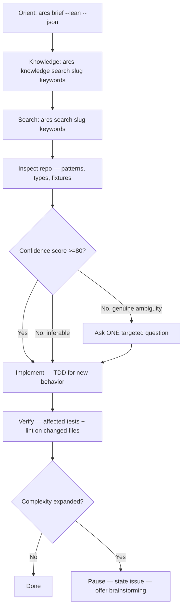

# Skill: code-agent

## When

Task is mostly clear (50-90%) but 1-2 decisions remain open — resolvable by inspecting the repo.

## Flow



## Phase 0: Check Existing Knowledge

Before investigating or implementing, check what the DAG already knows:

```bash
arcs knowledge search <slug> "<task-keywords>" --lean --json
```

Look for:
- `kind: pattern` — existing conventions that apply to this change
- `kind: gotcha` — known traps in this area
- `kind: lesson` — prior learnings from similar work

If relevant entries exist, incorporate their guidance. Don't rediscover what's already known.

## Behaviour

- Apply `the-ladder` during implementation — reach for stdlib / native / an installed dep before new code, and leave `// SHORTCUT:` markers for deliberate simplifications
- Inspect repo before asking anything
- Score self-confidence before any code edit; <80% triggers explore/web recovery, not improvisation
- Proceed on inferred defaults when repo makes it clear
- Ask at most one targeted question (product direction, naming, breaking trade-off)
- TDD for new non-trivial behavior; skip for structural changes covered by existing tests
- Lightweight bullet plan only when 3+ files and sequencing matters
- Verify scoped: lint + test only files you touched — NEVER the full suite. Pervasive change (shared types, config, build) or failures in out-of-scope files → report under BLOCKED_BY, never fix; full-project verification belongs to the devil-advocate completion gate

## NOT for

- Fully bounded, no decisions → `quick-dev`
- Unclear/creative/design-shaping → `brainstorming`
