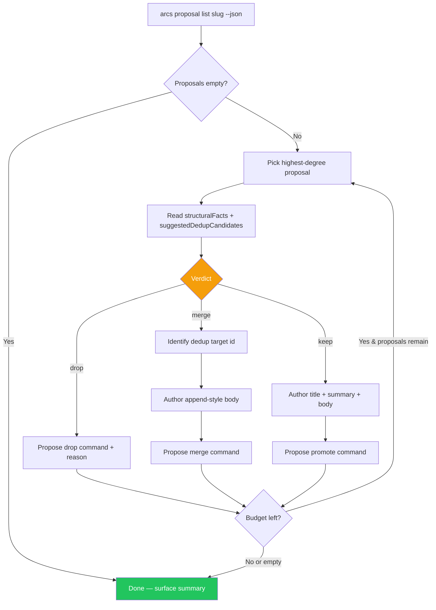

# Skill: enriching-codegraph-proposals

## When

The CLI surfaced raw codegraph proposals and is waiting for an agent to turn them into real knowledge entries. Mandatory triggers:

- `arcs project init` returned `codegraph.pending_enrichment: true` in its JSON envelope.
- `arcs codegraph-sync` returned `pending_enrichment: true`.
- User said "enrich the proposals", "process the codegraph queue", "promote the pending proposals", or similar.

> **Read-only proposal skill.** This skill reads the queue, reaches verdicts only after the evidence threshold below is met, and returns exact commands under `PROPOSED_MUTATIONS:`. It does not execute `arcs proposal promote/drop` or `arcs knowledge upsert`; the orchestrator applies approved mutations.

## Flow



## Decision Heuristics

This is the meat of the skill. Apply per proposal — never skip.

### Keep

Promote as a fresh knowledge entry when ALL of:

- The cluster / module covers a real architectural boundary AND existing knowledge does not already cover it (verify via `suggestedDedupCandidates` length 0 or low overlap).
- `structuralFacts.fileCount >= 3` and `fileTypeBreakdown` is code-dominant (`.ts`, `.tsx`, `.js`, `.py`, etc. — not 100% docs/templates/skills).
- `topHubs` includes named exports / functions / classes, not just file basenames.
- The boundary is distinct enough that a future agent editing inside it would benefit from a one-paragraph map.

### Drop

Propose `arcs proposal drop` when ANY of:

- `structuralFacts.fileTypeBreakdown` has zero code (all `.md`, `.mdx`, `.txt`, `.html` templates, skill files). T007 should already filter these — drop is defense-in-depth.
- Cluster covers test directories only (`test/`, `__tests__/`, `*.test.ts`, `*.spec.ts`, `tests/`).
- Cluster size `<= 2` distinct files — too small to be architecturally meaningful.
- All `topHubs` resolve to deprecated, dead, or vendored code (`vendor/`, `legacy/`, `_archive/`).
- `suggestedDedupCandidates` shows perfect overlap with an existing knowledge entry AND the proposal contributes no new structural insight (no new degree numbers, no new hubs, no new edges).
- Proposal is a near-duplicate of one already promoted in this session.

Always pass a `--reason` string. The reason is durable on the proposal-store ledger and helps future SYNC rounds skip the same noise.

### Merge

Propose `arcs proposal promote --merge-with=<existing-id>` when:

- `suggestedDedupCandidates` lists an existing knowledge entry whose `kind` matches the proposal's natural kind, AND
- The proposal adds genuinely new structural facts the existing entry does not already document (e.g. precise degree numbers, additional top hubs, cross-module edges, fileCount).

The agent appends a `## From codegraph analysis` section to the existing entry — it does NOT replace prior body content. Treat the existing entry as the spine; the merge adds a graph-evidence rib.

## Enrichment Output Contract

For every "keep" or "merge" verdict, the agent produces three fields. None may be the templated default from `ingestGraph`.

### `--title` (6–12 words)

Tell a human what this code surface DOES, not just where it lives. Verb- or role-led, specific.

| Bad (templated)             | Good (agent-authored)                                      |
|-----------------------------|------------------------------------------------------------|
| "Cluster of 7 entities"     | "Storage hub re-exporting helpers to all persistent stores" |
| "Module storage-utils"      | "Task / plan / knowledge front-matter parser & guards"     |
| "Architecture: src/cli"     | "CLI router and command-registry dispatch surface"         |

### `--summary` (1–2 sentences, action-oriented)

State what the boundary is and what ripples when it changes. Prefer concrete consequences over abstract description.

> Example: "Storage hub re-exporting `nowISO` and `sanitizeFileRefs` to all three persistent stores; editing here ripples through every persistent surface and the file-lock contract."

### `--body` (3–5 paragraphs)

Suggested structure — adapt as needed but cover all five beats:

1. **What it is** — one sentence definition of the architectural boundary.
2. **Top hubs and what they do** — brief expansion of `structuralFacts.topHubs`. Name each hub, name its responsibility in one clause.
3. **Cross-cutting implications** — what depends on this surface; what this surface depends on. Pull from `structuralFacts.crossModuleEdges` if present.
4. **When to read this entry** — concrete agent-facing trigger. ("Before editing `storage-utils.ts`. Before adding a new field to any task / plan / knowledge front-matter. Before changing the file-lock policy.")
5. **Cross-references** — link to related knowledge entries by id (use `suggestedDedupCandidates` and `arcs related` output).

Always pass `--source-files` listing the files in `structuralFacts.fileList` (or the top-N if list is huge — cap at 12 paths). Graph-retrieval `shares_source_file` edges weight 0.9; without `--source-files` the entry is invisible to the graph.

## Cost Discipline

- **Cap at 12 enrichments per session.** If proposals list exceeds 12, drop low-signal entries en masse before enriching the keep set.
- **Process highest-degree clusters first.** Sort proposals by `structuralFacts.degree` descending; the top 3–5 carry most of the value.
- **Bulk-triage early.** Proposing drops for obvious noise in one pass is cheaper than enriching one and discovering the next is also noise.
- **Stop early on budget.** If the agent has spent ~12 enrichments, drop the remainder with reason `"session budget exhausted; reconsider next sync"` rather than producing rushed entries.

## Failure Modes

| Symptom                                                   | Recovery                                                                                       |
|-----------------------------------------------------------|------------------------------------------------------------------------------------------------|
| Proposed merge target no longer exists at apply time     | Orchestrator rejects it; return for re-audit rather than changing the command during apply.    |
| Body too long for shell argv (errno E2BIG / argv overflow)| Switch to `--body-file=path/to/body.md` or pipe via `--body-stdin`.                            |
| Proposal disappears before return                         | Re-list read-only, omit it, and report the race.                                                |
| Proposed entry would miss graph edges                     | Verify `--source-files` is present and points at real paths under the project root.             |
| `structuralFacts` field absent                            | Treat as drop candidate — proposal has no evidence to enrich from.                             |
| Verdict drift: same proposal triaged twice in one session | Re-list with `arcs proposal list --json` — the store is the single source of truth.            |

## Constraints

- **Do not invent structural facts** not present in `structuralFacts`. If real-code grounding is needed, defer to `arcs context <slug> --audience=<role>` or `arcs related <slug> <id>` and read source. Hallucinated graph facts poison every downstream retrieval.
- **Always specify `--source-files`** on promote — graph-retrieval depends on it (per AGENTS.md "Knowledge gravity"). An entry without source files is a leaf with no inbound edges.
- **Never edit `.mmd` files** directly — diagram ownership rules in AGENTS.md still apply during enrichment.
- **No batch promote.** Each proposed promote is one decision and one command. Bulk promotion bypasses dedup checks and per-proposal review.
- **Preserve proposal IDs in summaries** when reporting back so the human can audit the verdict ledger.

## Worked Example

```bash
# 1. List pending proposals (highest-degree first by default)
arcs proposal list arcs --json

# 2. PROPOSED_MUTATIONS: drop obvious noise
arcs proposal drop arcs prop_test_dirs_only \
  --reason="cluster covers test/ only — defense in depth past T007 filter" --json

# 3. PROPOSED_MUTATIONS: promote a keep verdict with full enrichment
arcs proposal promote arcs prop_storage_hub \
  --title="Storage hub re-exporting helpers to all persistent stores" \
  --summary="Central re-export point for nowISO and sanitizeFileRefs used by task/plan/knowledge stores; edits ripple through every persistent surface." \
  --body-file=/tmp/storage-hub.body.md \
  --kind=architecture \
  --source-files=src/utils/storage-utils.ts,src/utils/task-store.ts,src/utils/plan-store.ts,src/utils/knowledge-store.ts \
  --json

# 4. PROPOSED_MUTATIONS: merge into an existing entry
arcs proposal promote arcs prop_cli_registry \
  --merge-with=cli-registry-pattern-handlers-typed-via-parsedparams \
  --body-file=/tmp/cli-registry-graph-evidence.md \
  --source-files=src/cli/command-registry.ts,src/cli/index.ts \
  --json

# Return these commands without executing them; the orchestrator applies approved mutations.
```

## Exit

Return `PROPOSED_MUTATIONS:` with one stable proposal ID, verdict, rationale, and exact command per item. Do not execute `arcs knowledge upsert` or proposal mutations. Surface a one-line summary to the orchestrator: proposed keeps N, merges M, drops K, deferred D.
