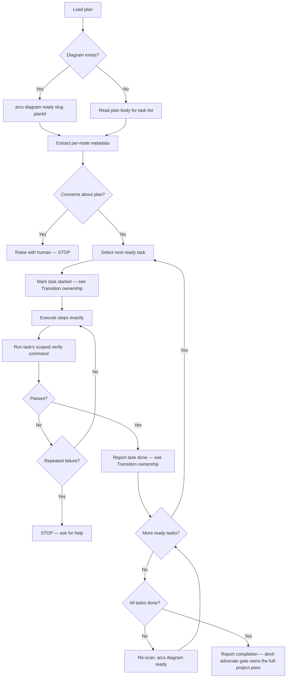

# Skill: executing-plans

## When

You have a written implementation plan to execute task-by-task with verification checkpoints.

**NOT for:**
- If subagents are available → use `subagent-driven-development` instead (parallel dispatch, two-stage review)
- If the task needs iterative self-correction without a structured plan → use `loop` instead

> CLI: `arcs --commands --json` for discovery. Mutating commands run directly — no token.

## Flow



## Diagram-First Task Selection

When plan has `.diagram.mmd`:
1. `arcs diagram ready <slug> <planId>` → executable nodes (deps all `:::done`)
2. Read per-node `%%` metadata: `node`, `skill`, `scope`, `files`, `acceptance`, `verify`
3. After each transition, re-scan for newly-unblocked nodes
4. If metadata incomplete → fall back to plan body for that task

**Dependency-aware ordering:** `arcs next` respects `dependsOn` — it only surfaces tasks whose dependencies are all `done`. Use `arcs next` as the authoritative source for what's executable; you don't need to manually parse `.mmd` for ordering. `arcs diagram ready` remains useful for per-plan metadata inspection.

**Transition ownership:** When dispatched by the ARCS orchestrator, you never run `arcs task transition` — report each task done in your return envelope (STATUS/FILES_TOUCHED/VERIFY) and the orchestrator transitions after the execute gate passes. Only when running standalone (no orchestrator session) transition yourself, with both flags: `arcs task transition <slug> <taskId> done --diagramNodeId=T001 --planId=<planId>`

**Verify scope rule:** Run ONLY the current task's `verify` command, scoped to that task's `files`. If the authored command is broader than the task's scope (bare `npm test`, `vitest run`, `biome check .`), narrow it to the touched files first (e.g. `npm test -- test/orders.test.ts`). Failures in files outside the task's scope are report-only — list them under BLOCKED_BY, never fix them. Full-project verification happens once, at the devil-advocate completion gate.

**Directed gotcha read before each task:** Before executing a task, search the DAG for known traps in its area so you don't walk into one the plan didn't anticipate: `arcs knowledge search <slug> "<task-keywords>" --lean --json`, filtering for `kind=gotcha`. Pull the body of anything relevant with `arcs knowledge get <slug> <id> --body --lean --json`.

## Sub-Agent Context

Fetch once, then paste the relevant output into each dispatch's CONTEXT — don't make sub-agents re-fetch:
```bash
arcs context <slug> --audience=implementer --lean --json
arcs search <slug> "<task-keywords>" --lean --json
```

Sub-agents run `arcs` lookups only to fill gaps the dispatch left open — never to re-derive what CONTEXT already states.

Sub-agents MUST NOT edit `.mmd` files — orchestrator owns diagram updates.

## Review Checkpoint Criteria

**STOP executing immediately when:**
- Missing dependency or unclear instruction
- Verification fails repeatedly (2+ attempts)
- Plan has critical gaps preventing progress
- Fundamental approach needs rethinking

Ask for clarification rather than guessing. Don't force through blockers.

## Capturing Execution Discoveries

When execution surfaces something the plan didn't know — a plan-vs-reality delta, a gotcha hit mid-task, a convention the plan got wrong — capture it so the "new knowledge entries" sync trigger below actually fires: `arcs knowledge upsert <slug> "<title>" --kind=<gotcha|lesson> --summary="<what reality diverged from the plan / the trap hit>" --keywords="<k1,k2>" --source-files="<path,...>" --json`. Skip when execution matched the plan exactly. Upsert is idempotent by title.

## Auto-Sync Triggers

Post-execution DAG sync fires automatically when:
- 3+ tasks transitioned this session
- New knowledge entries created from discoveries
- `lastSyncedAt` > 7 days ago
- Plan reached `done` status

## Constraints

- Review plan critically before starting — raise concerns first
- Follow plan steps exactly — don't improvise
- Never skip verifications — and never widen them beyond the task's scope
- Never start on main/master without explicit consent
- Reference sub-skills when plan specifies them
- After all tasks complete: report completion — the devil-advocate completion gate runs the single full-project verification
