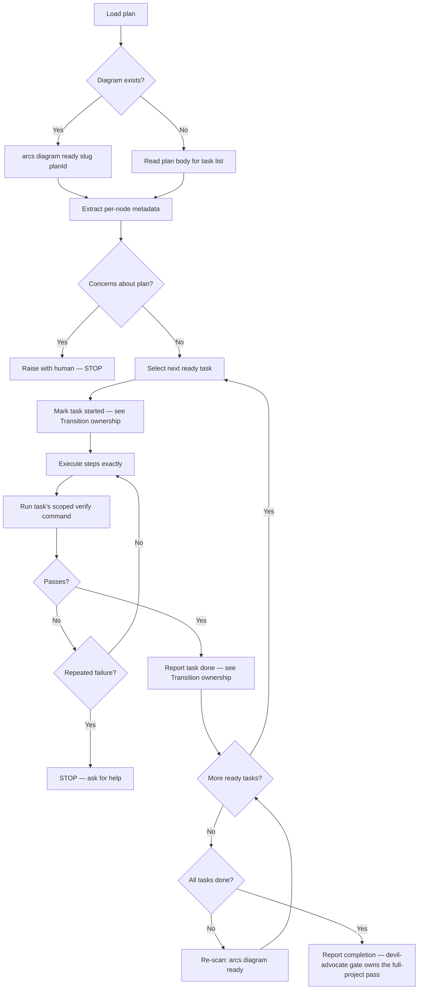
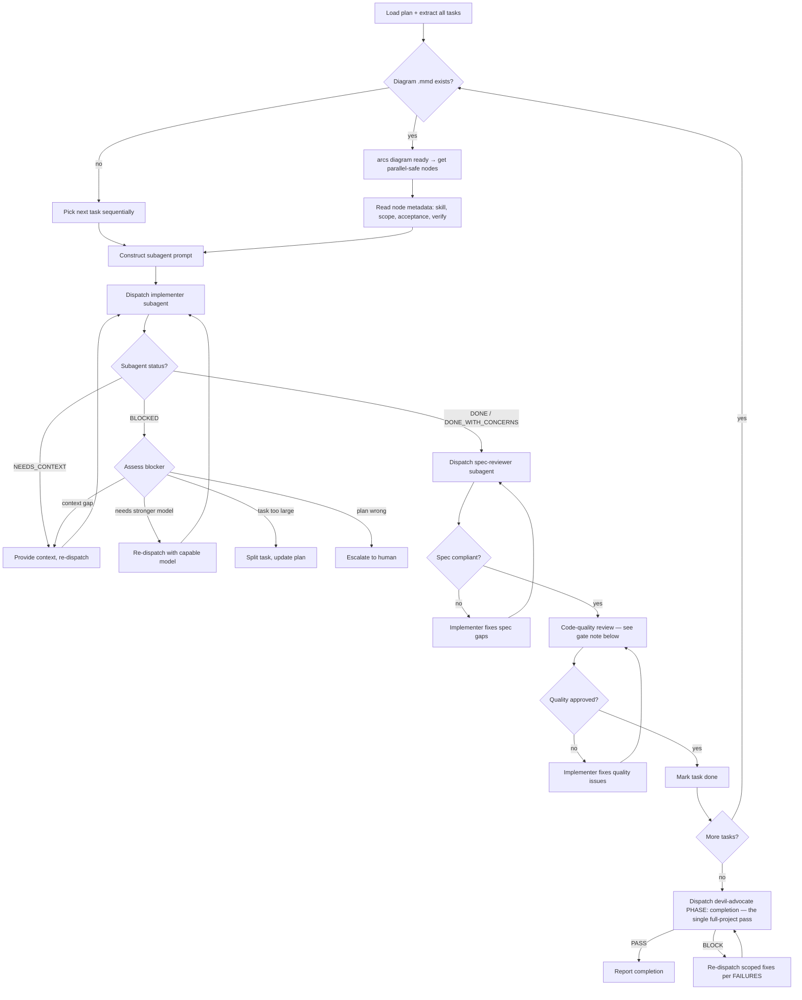
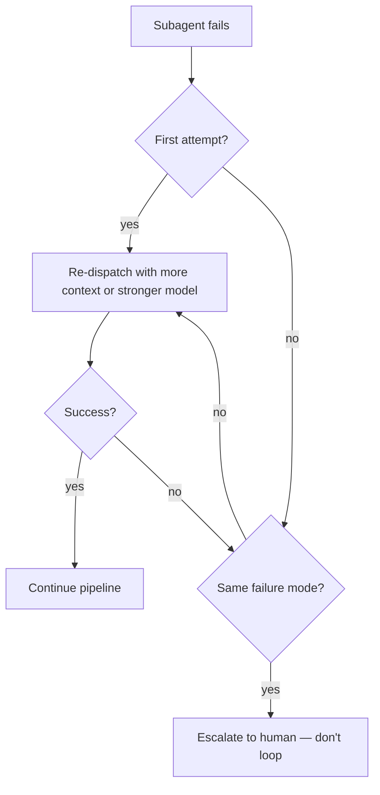

# Skill: executing-plans

## When

You have a written implementation plan to execute task-by-task with verification checkpoints.

**NOT for:**
- If the task needs iterative self-correction without a structured plan → use `loop` instead

Sequential single-agent execution is the **default**. When the orchestrator signals 2+ independent sub-problems, switch to **Parallel Mode** (below) — fan-out multi-agent dispatch of independent ready nodes with two-stage review.

> CLI: `arcs --commands --json` for discovery. Mutating commands run directly — no token.

## Flow



## Diagram-First Task Selection

When plan has `.diagram.mmd`:
1. `arcs diagram ready <slug> <planId>` → executable nodes (deps all `:::done`)
2. Read per-node `%%` metadata: `node`, `skill`, `scope`, `files`, `acceptance`, `verify`
3. After each transition, re-scan for newly-unblocked nodes
4. If metadata incomplete → fall back to plan body for that task

**Dependency-aware ordering:** `arcs next` respects `dependsOn` — it only surfaces tasks whose dependencies are all `done`. Use `arcs next` as the authoritative source for what's executable; you don't need to manually parse `.mmd` for ordering. `arcs diagram ready` remains useful for per-plan metadata inspection.

**Transition ownership:** When dispatched by the ARCS orchestrator, you never run `arcs task transition` — report each task done in your return envelope (STATUS/FILES_TOUCHED/VERIFY) and the orchestrator transitions after the execute gate passes. Only when running standalone (no orchestrator session) transition yourself, with both flags: `arcs task transition <slug> <taskId> done --diagramNodeId=T001 --planId=<planId>`

**Verify scope rule:** Run ONLY the current task's `verify` command, scoped to that task's `files`. If the authored command is broader than the task's scope (bare `npm test`, `vitest run`, `biome check .`), narrow it to the touched files first (e.g. `npm test -- test/orders.test.ts`). Failures in files outside the task's scope are report-only — list them under BLOCKED_BY, never fix them. Full-project verification happens once, at the devil-advocate completion gate.

**Directed gotcha read before each task:** Before executing a task, search the DAG for known traps in its area so you don't walk into one the plan didn't anticipate: `arcs knowledge search <slug> "<task-keywords>" --lean --json`, filtering for `kind=gotcha`. Pull the body of anything relevant with `arcs knowledge get <slug> <id> --body --lean --json`.

## Sub-Agent Context

Fetch once, then paste the relevant output into each dispatch's CONTEXT — don't make sub-agents re-fetch:
```bash
arcs context <slug> --audience=implementer --lean --json
arcs search <slug> "<task-keywords>" --lean --json
```

Sub-agents run `arcs` lookups only to fill gaps the dispatch left open — never to re-derive what CONTEXT already states.

Sub-agents MUST NOT edit `.mmd` files — orchestrator owns diagram updates.

## Parallel Mode

When the orchestrator signals 2+ independent sub-problems, execute the plan via fresh subagents fanned out across independent ready nodes, with two-stage review per task. This replaces the sequential single-agent walk above with diagram-first parallel dispatch.

### Parallel Flow



**Gate cap:** two consecutive completion BLOCKs → stop and escalate to human; never loop the V→X cycle a third time.

**Under the ARCS orchestrator:** the orchestrator's devil-advocate PHASE: execute gate replaces the code-quality reviewer step (the gate runs the scoped VERIFY and the drift check); spec review remains. Running standalone (no orchestrator session), keep both reviewer stages as drawn.

### Retry & Escalation



### Diagram-First Dispatch

When the plan has a `.mmd` file:

1. `arcs diagram ready <slug> <planId>` → all returned nodes are dispatch-safe in parallel
2. Use per-node `%%` metadata (`skill`, `scope`, `files`, `acceptance`, `verify`) to construct prompts
3. After completion: `arcs task transition <slug> <taskId> done --diagramNodeId=T001 --planId=<planId>` (standalone only — under the orchestrator, report done and let it transition)
4. Re-run `diagram ready` to discover newly-unblocked nodes
5. If node metadata is incomplete, fall back to reading the plan body for that task

**Ownership:** Dispatcher owns `.mmd` updates. Implementer subagents MUST NOT edit diagrams.

### Sub-Agent Prompt Construction

Every implementer subagent prompt MUST include:

| Section | Content |
|---------|---------|
| **Goal** | Exact task description from plan (full text, not summary) |
| **Context** | Where this task fits in the plan; what came before |
| **Scope** | File boundaries — what to touch, what NOT to touch |
| **Acceptance** | Done criteria copied verbatim from plan/diagram |
| **Verify** | Exact command to run before claiming done — scoped to the task's files, never the full suite |
| **Skill** | Which work-mode skill to load (from diagram metadata or inferred) |
| **Return** | Structured Return envelope (below) — brief prose findings first, JSON block last |

Do NOT make the subagent read the plan file. Provide full text in the prompt. Prompt templates: `./implementer-prompt.md`, `./spec-reviewer-prompt.md`, `./code-quality-reviewer-prompt.md`.

### Model Selection

| Task complexity | Model tier |
|----------------|-----------|
| 1-2 files, clear spec, mechanical | Fast/cheap |
| Multi-file integration, pattern matching | Standard |
| Architecture, design, review | Most capable |

### Structured Return

All sub-agents MUST return a JSON block as the LAST thing in their message — brief prose findings first, JSON block last, nothing after it:

```json
{
  "status": "DONE | DONE_WITH_CONCERNS | BLOCKED | NEEDS_CONTEXT",
  "summary": "<1-2 sentences>",
  "payload": { "<role-specific fields per prompt template>": "..." }
}
```

Role payloads: implementer → `filesChanged`/`filesCreated`/`verification{command,result,scopeReason}`/`concerns`/`scopeChanges`; spec reviewer → `compliant`/`issues`; quality reviewer → `approved`/`issues`.
Orchestrator parses `status` for routing, `payload` for action.
Mapping to the orchestrator's Standard Return Envelope: DONE→done, DONE_WITH_CONCERNS→done + concerns surfaced, BLOCKED→blocked, NEEDS_CONTEXT→blocked.

Include in every dispatch prompt:
> "Return format: brief prose findings first, then the JSON envelope (status + typed payload) from your role's prompt template as the LAST thing in your message — nothing after it."

### Review Gates

- **Spec review** (always): a fresh reviewer verifies the implementer built what was requested — nothing more, nothing less. Reads the actual code, never trusts the report. See `./spec-reviewer-prompt.md`.
- **Code-quality review** (standalone only): a fresh reviewer verifies the implementation is clean, tested, maintainable. See `./code-quality-reviewer-prompt.md`. **Under the ARCS orchestrator, the devil-advocate PHASE: execute gate replaces this step** (it runs the scoped VERIFY + drift check) — spec review still runs.
- Spec review BEFORE code quality review (never reverse). Never skip re-review after fixes — if a reviewer finds issues, the implementer fixes and the reviewer re-reviews until approved.

### Parallelism Rules

Parallel implementers are allowed when tasks touch **zero shared files**.

1. **Independence check:** verify no file overlap before dispatch. If overlap → serialize.
2. **Batch limit:** maximum 4 concurrent subagents per round. Queue remaining.
3. **Prompt construction:** per the Sub-Agent Prompt Construction table above — all rows required.
4. **Conflict detection:** after fan-out completes, check for conflicting edits before committing.
5. **Shared context:** fetch once (e.g., project brief), inject into all subagent prompts — don't make each agent re-fetch.

**When to serialize instead:**
- Tasks share source files (even different functions in same file)
- Task B's approach depends on Task A's output
- Both tasks modify test fixtures or shared mocks

### Knowledge Capture at Fan-In

The `concerns`, `scopeChanges`, and `DONE_WITH_CONCERNS` payloads collected from each subagent are near-free durable signal — don't discard them. At fan-in, route the durable items (a non-obvious trap hit, a convention that had to be discovered, a plan-vs-reality delta) into the DAG: `arcs knowledge upsert <slug> "<title>" --kind=<gotcha|pattern> --summary="<1-2 sentences>" --keywords="<k1,k2>" --source-files="<path,...>" --json`. Skip purely mechanical or task-local notes. Upsert is idempotent by title.

### Git State Discipline (Parallel)

- Sub-agents MUST NOT run `git stash` — ever, under any circumstance
- Sub-agents MUST NOT run `git checkout` on shared branches
- Sub-agents commit their changes atomically (scoped to task files) before reporting back
- Other agents may be working concurrently — do not assume a clean worktree
- Use `git diff HEAD -- <your-files>` to verify YOUR changes only — bare `git diff` is unreliable in parallel
- If you see unexpected changes in files outside your scope: **ignore them** — they belong to another agent

### Parallel Mode Constraints

- Fresh subagent per task — never reuse session context
- Parallel implementers only when zero file overlap (dispatcher verifies)
- Never ignore BLOCKED/NEEDS_CONTEXT status — something must change
- DONE_WITH_CONCERNS: read concerns before proceeding; address if correctness/scope related
- Scope changes discovered by subagents: report in summary, dispatcher handles diagram regeneration

## Review Checkpoint Criteria

**STOP executing immediately when:**
- Missing dependency or unclear instruction
- Verification fails repeatedly (2+ attempts)
- Plan has critical gaps preventing progress
- Fundamental approach needs rethinking

Ask for clarification rather than guessing. Don't force through blockers.

## Capturing Execution Discoveries

When execution surfaces something the plan didn't know — a plan-vs-reality delta, a gotcha hit mid-task, a convention the plan got wrong — capture it so the "new knowledge entries" sync trigger below actually fires: `arcs knowledge upsert <slug> "<title>" --kind=<gotcha|lesson> --summary="<what reality diverged from the plan / the trap hit>" --keywords="<k1,k2>" --source-files="<path,...>" --json`. Skip when execution matched the plan exactly. Upsert is idempotent by title.

## Auto-Sync Triggers

Post-execution DAG sync fires automatically when:
- 3+ tasks transitioned this session
- New knowledge entries created from discoveries
- `lastSyncedAt` > 7 days ago
- Plan reached `done` status

## Constraints

- Review plan critically before starting — raise concerns first
- Follow plan steps exactly — don't improvise
- Never skip verifications — and never widen them beyond the task's scope
- Never start on main/master without explicit consent
- Reference sub-skills when plan specifies them
- After all tasks complete: report completion — the devil-advocate completion gate runs the single full-project verification
