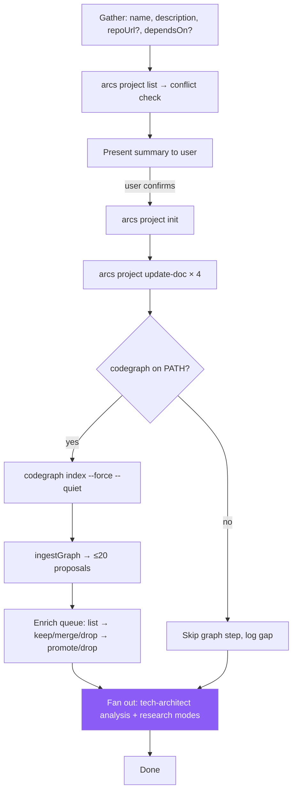

# Skill: init-project

## When

User wants to track a new project, bootstrap documentation, or connect a repo to the ARCS DAG. Triggers: "new project", "track this repo", "add project X", "init <repo>".

> **Canonical orchestrator workflow:** `src/cli/arcs-orchestrate.ts` under `### INIT Workflow` — this skill mirrors that flow with full operational detail. If the two diverge, the orchestrator prompt wins.

## Flow



## CLI Primer

```bash
arcs project init "Foo" --description="..." --path="$(pwd)" --json
```
Discovery: `arcs --commands --json`. Mutating commands run directly — no token.

## Constraints

- Do NOT read repo to infer name/description — gather from user
- Verify `dependsOn` targets exist via `arcs project list --json`
- `arcs project init` creates empty `plans/`, `knowledge/`, `tasks/` indexes — don't pre-populate
- Repo analysis is **fan-out across typed agents**, never a generic "analysis sub-agent" (see Agent Dispatch below)
- Never block INIT on codegraph — it's optional. Skip cleanly if missing.

## Codegraph Sub-Flow (DEFAULT: ON when binary present)

The orchestrator runs codegraph directly during INIT to produce structural **proposals** before any sub-agent reads code. Proposals are durable on the proposal-store ledger; agents enrich them into knowledge entries via the `enriching-codegraph-proposals` skill. This is the default path when `codegraph` is on PATH; skip cleanly otherwise.

1. **Detect:** call `detectCodegraph()` from `src/utils/codegraph.ts`. If unavailable, log "codegraph not on PATH; proceeding without graph signal" and skip steps 3–6.
2. **Trust the gitignore guarantee:** `runIndex()` already auto-appends `.codegraph/` to `.gitignore` via `ensureGitignoreEntry`. Do NOT redundantly check or modify `.gitignore` from agents — running the index is sufficient.
3. **Index** (project-based; CLI drives the bundled runtime — no LLM API key required):
   ```bash
   codegraph index <workspacePath> --force --quiet
   ```
   Builds a per-project codegraph index under `<workspacePath>/.codegraph/`.
4. **Ingest as proposals:** `arcs project init` internally calls `ingestGraph(slug)`, which parses codegraph CLI `--json` output and writes up to 20 structural proposals to `proposals/graphify.json` (filename retained for compatibility; rename pending; test files filtered):
   - 8 god nodes (`kind=module`, ranked by callers+callees / impact as a proxy for degree)
   - 8 architecture clusters (`kind=architecture`, synthesized pseudo-communities by directory prefix — codegraph has no community/cluster export)
   - 5 cross-module couplings (`kind=gotcha`, high-degree links across top-level dirs; relations hard-coded as `["calls"]`)

   Codegraph never writes directly to the knowledge surface. The init envelope returns `data.codegraph.pending_enrichment: true` to signal that proposals are waiting.
5. **Enrich** with the `enriching-codegraph-proposals` skill — read `arcs proposal list <slug> --json`, decide per-proposal verdicts (keep / merge / drop), and return exact proposed promote/drop commands for orchestrator application. Pending codegraph proposals never bypass this lifecycle into knowledge.
6. **Optional graph queries** for evidence during enrichment (sub-agents may run these via the codegraph MCP server, which auto-syncs through its own file watcher):
   - `codegraph_search "entry points and main commands"` → seeds for "key files" reference entries
   - `codegraph_explore` on core modules → seeds for "core modules" entries
   - `codegraph_node "<godNodeLabel>"` → structural summary for module entry bodies
   - `codegraph_impact "<critical-symbol>"` → reverse-impact map for high-risk modules
   - `codegraph_callers` / `codegraph_callees "<symbol>"` → dependency paths for architecture entries
7. **Hand to typed agents** (in parallel) for independently authored, code-grounded follow-up entries beyond the proposal queue — see **Agent Dispatch** below.

## Content Guidelines

| Doc | Format |
|-----|--------|
| `overview.md` | 2-3 sentence summary + goals |
| `tasks.md` | `[ ]` backlog / `[/]` in-progress / `[x]` done |
| `dependencies.md` | Upstream + downstream sections |
| `knowledge.md` | High-level context + pointers to structured entries |

Update via `arcs project update-doc <slug> <doc> --content="..."`.

## Agent Dispatch (named typed agents — DO NOT default to a generic analysis agent)

| Sub-agent | Owns | Knowledge kinds it produces |
|-----------|------|----------------------------|
| `tech-architect` (analysis mode) | Module boundaries, clusters, dependency direction, cross-module couplings, structural gotchas, lessons | `architecture`, `module`, `gotcha`, `lesson` |
| `tech-architect` (`AGENT_MODE: research`) | Tech stack, third-party libraries, key files, features | `reference`, `feature` |
| `code-reviewer` (audit mode, optional) | Coding-style + convention scan from existing code | `pattern` |

Dispatch in parallel — all agents in one message, per the orchestrator's Parallelism rules. Each agent receives:
- The relevant `KnowledgeProposal` records from `ingestGraph` (so they don't rediscover what codegraph already found)
- Targeted codegraph queries for evidence (e.g., `codegraph_node` / `codegraph_impact` output for the modules they own)
- Explicit scope (which files / which kinds to produce)

Raw `KnowledgeProposal` records stay in the proposal lifecycle above. Each typed agent may instead return an independently authored finding: `{title, kind, summary, keywords, sourceFiles, body}`. Workers do not execute `arcs knowledge upsert`; after deduplication they return substantive ready-to-run commands for orchestrator fan-in persistence.

## Knowledge Categories for Analysis Sub-Agents

| Category | Kind | What to discover | Primary agent |
|----------|------|------------------|---------------|
| tech stack | `architecture` | Languages, frameworks, runtimes, build tools, versions | `tech-architect` (`AGENT_MODE: research`) |
| key files | `reference` | Entry points, config files, main modules, purposes | `tech-architect` (`AGENT_MODE: research`; use `codegraph_search "entry points"`) |
| code patterns | `pattern` | Recurring design patterns, abstractions, error handling | `code-reviewer` (audit mode) or `tech-architect` |
| coding style | `pattern` | Formatting, linting, import ordering, file organization | `code-reviewer` (audit mode) |
| core modules | `module` | Core modules / shared functions — what, where, interconnections | `tech-architect` (god nodes from codegraph) |
| external services | `module` | APIs, databases, message queues the project interacts with | `tech-architect` (`AGENT_MODE: research`) |
| third-party libraries | `reference` | Key dependencies and why they are used | `tech-architect` (`AGENT_MODE: research`) |
| features | `feature` | Major user-facing or system-facing features | `tech-architect` (`AGENT_MODE: research`) |
| cross-module couplings | `gotcha` | Hot edges between modules surfaced by codegraph | `tech-architect` (auto from `ingestGraph`) |
| architecture clusters | `architecture` | Pseudo-community / directory groupings from codegraph | `tech-architect` (auto from `ingestGraph`) |

## Worked Example

```bash
# 1. Conflict check
arcs project list --json

# 2. Present summary to user; on confirmation, init
arcs project init "Foo" --description="Foo CLI tool" --path="$(pwd)" --json

# 3. Update docs
arcs project update-doc foo overview --content="..." --json
# ... repeat for tasks, dependencies, knowledge

# 4. Codegraph (if available) — runs inside `arcs project init`
codegraph index . --force --quiet
# ingestGraph parses codegraph CLI --json → proposals/graphify.json (filename retained; rename pending)
# init envelope: data.codegraph.pending_enrichment === true → load
# `enriching-codegraph-proposals` and run the verdict loop:
arcs proposal list foo --json
# keep: promote only after authoring the required title, summary, body, and source files
arcs proposal promote foo <id> --title="..." --summary="..." --body-file=... --kind=module --source-files=... --json
# merge: promote with --merge-with=<existing-knowledge-id> and append graph evidence
arcs proposal promote foo <id> --merge-with=<existing-knowledge-id> --body-file=... --source-files=... --json
arcs proposal drop foo <id> --reason="..." --json

# 5. Fan out typed agents (parallel) for entries beyond proposal scope
#    tech-architect (analysis mode)          → architecture/module/gotcha/lesson entries
#    tech-architect (AGENT_MODE: research)   → reference/feature entries

# 6. Propose only independently authored, non-proposal-derived findings.
# Obtain the kind-specific body anatomy before authoring the ready-to-run command:
arcs knowledge template --kind=architecture --json
arcs knowledge upsert foo "Tech stack: TypeScript + Node 20" --kind=architecture --summary="..." --body-file=... --source-files=package.json --json
# Return the upsert; do not execute it. The orchestrator persists it at fan-in.
```

## Exit Conditions

| Condition | Action |
|-----------|--------|
| Project already in DAG (slug collision) | Stop. Surface conflict; ask user to rename or use existing |
| User declines summary | Stop. No mutations performed |
| `codegraph` missing | Continue without graph signal; sub-agents run with code reading only |
| `dependsOn` target missing | Stop. Ask user to init dependencies first or remove the link |
| Init succeeds but knowledge fan-out fails | Project exists in DAG; rerun knowledge phase later via SYNC |
