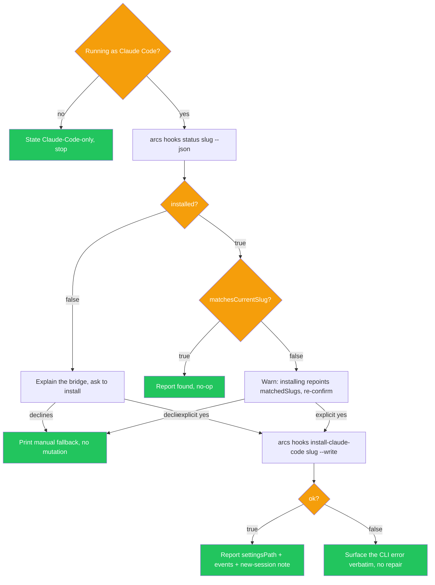

# Skill: install-claude-code-hook

## When

The project is already in the DAG but its workspace never got the session-bridge hook — usually because `arcs project init` predated the offer, or the offer was declined. Triggers: "install the claude code hook", "enable session bridge", "set up hook for this project", "hook up claude code to arcs", "the arcs web UI can't see my session".

> **Claude-Code-only skill.** Step 0 is self-knowledge, not detection: if you are not running as Claude Code, say so and stop. The hook registers into Claude Code's own settings file; installing it from another harness configures a client that will never run it. There is no environment-variable heuristic here by design — you know your own harness.

> **Executes, unlike the proposal skills.** After explicit user confirmation this skill runs `arcs hooks install-claude-code <slug> --write` itself. That is not a `writing-knowledge`-style "propose, don't execute" case: the write is local machine config (`.claude/settings.local.json`), not a durable ARCS DAG mutation. It mirrors `promptAndInstallClaudeCodeHook`, which already executes directly inside `arcs project init` behind the same confirm.

## Flow



## CLI Primer

```bash
arcs hooks status <slug> --json
arcs hooks install-claude-code <slug> --write --json
```
Discovery: `arcs --commands --json`. Mutating commands run directly — no token.

`hooks status` is read-only and rotates nothing, so it is safe to call as many times as you like. Its envelope:

| Field | Meaning |
|---|---|
| `installed` | `true` only when ALL THREE events (`SessionStart`, `UserPromptSubmit`, `SessionEnd`) are registered. A partial registration is a broken bridge and reports `false`. |
| `matchesCurrentSlug` | The registered hook carries `ARCS_HOOK_SLUG=<slug>` for the project you asked about. |
| `matchedSlugs` | Every slug found on a matching hook command — how you see a hook wired to a *different* project. |
| `hookScriptPath` | Absolute path of the script the hook entry runs; the key both status and install match on. |

`hooks install-claude-code <slug> --write` performs the write via the same consent-gated merge `arcs project init` uses, and returns `settingsPath` and `events` alongside the pre-existing `token` / `hookScriptPath` / `serverUrl` / `settingsSnippet` fields. Omitting `--write` keeps the old snippet-only behavior — no file is touched — which is the manual fallback.

## Constraints

- Step 0 first: not Claude Code → state that this skill is Claude-Code-only and stop. No install, no status call.
- Never write without EXPLICIT user confirmation. Default posture is do nothing; silence, ambiguity, or "sure, whatever you think" is not consent.
- `matchesCurrentSlug: false` with a non-empty `matchedSlugs` demands a SECOND, explicit re-confirmation — the merge is keyed on `hookScriptPath`, so one workspace holds one hook and installing silently repoints it away from the other slug.
- Never edit `.claude/settings.local.json`, `.claude/settings.json`, or `~/.claude/settings.json` yourself. `--write` is the only sanctioned mutation path.
- Install failure (malformed existing settings file) → surface the CLI's own error message verbatim. Do NOT repair, reformat, or delete the settings file from this skill; the CLI aborted precisely so a hand-edited file is not clobbered.
- Do not rerun `--write` "to be safe" — every run rotates the token and invalidates the previously installed entry.
- Pass `--url` only when the user runs `arcs web` on a non-default port; the hook posts to `http://127.0.0.1:4173` otherwise.

## Opt-In Copy (what the user must be told before confirming)

State all four, plainly, before asking:

1. **What it buys them** — the ARCS web UI can see this Claude Code session, and messages queued from the UI are delivered to the next prompt.
2. **What is written** — `<workspacePath>/.claude/settings.local.json` and nothing else. Never the global config, never a committed file; `settings.local.json` is the git-ignored variant and the token in it is a secret.
3. **What is registered** — one script under three events: `SessionStart`, `UserPromptSubmit`, `SessionEnd`.
4. **When it takes effect** — a NEW Claude Code session. The session asking for the install will not pick it up.

## Worked Example

```bash
# 0. Self-check: you are Claude Code. If not → "This skill is Claude-Code-only." Stop here.

# 1. Read-only detection (rotates nothing; safe to repeat)
arcs hooks status arcs --json
# → {"installed":false,"matchesCurrentSlug":false,"matchedSlugs":[],
#    "hookScriptPath":"/…/scripts/claude-code-session-hook.mjs"}

# 2. Not installed → present the opt-in copy above, then ask:
#    "Install the Claude Code session-bridge hook for `arcs` now?"
#    Wait for an explicit yes. Anything else → step 4.

# 3. Explicit yes → install and report
arcs hooks install-claude-code arcs --write --json
# → {"settingsPath":"/home/u/Work/arcs/.claude/settings.local.json",
#    "events":["SessionStart","UserPromptSubmit","SessionEnd"], …}
# Report: settingsPath, the three events, and "start a NEW Claude Code session to pick it up".

# 4. Declined → no mutation. Print the manual fallback (snippet only, writes nothing):
arcs hooks install-claude-code arcs --json
# Paste `settingsSnippet` into .claude/settings.local.json by hand.
```

Already-installed branch:

```bash
arcs hooks status arcs --json
# → {"installed":true,"matchesCurrentSlug":true,"matchedSlugs":["arcs"], …}
# Report "session-bridge hook already installed for `arcs`". No-op. Done.
```

Different-slug branch:

```bash
arcs hooks status arcs --json
# → {"installed":true,"matchesCurrentSlug":false,"matchedSlugs":["legacy-app"], …}
# Warn: "This workspace's hook is registered for `legacy-app`. One workspace holds
#        one hook by design — installing for `arcs` will silently repoint it and
#        `legacy-app` will stop reporting sessions."
# Require a SECOND explicit confirmation, then:
arcs hooks install-claude-code arcs --write --json
```

Failure branch:

```bash
arcs hooks install-claude-code arcs --write --json
# → {"ok":false,"code":"hook_install_error","message":"/…/.claude/settings.local.json exists
#     but is not valid JSON — fix it manually or delete it, then re-run
#     `arcs hooks install-claude-code arcs`. Nothing was written."}
# Relay that message verbatim. Do not touch the file.
```

## Exit Conditions

| Condition | Action |
|-----------|--------|
| Not running as Claude Code | Stop. State the skill is Claude-Code-only; run nothing |
| `installed: true` and `matchesCurrentSlug: true` | Stop. Report already installed; no-op |
| `installed: true` and `matchesCurrentSlug: false` | Warn that installing repoints the hook away from `matchedSlugs`; require a second explicit confirmation before `--write` |
| `installed: false` | Present the opt-in copy; install only on explicit confirmation |
| User declines at any confirmation | Stop. No mutation. Print the manual fallback: `arcs hooks install-claude-code <slug> --json` (snippet only, no `--write`) |
| `--write` succeeds | Report `settingsPath` and `events`; tell the user a NEW Claude Code session is required |
| `--write` fails (e.g. malformed settings file) | Surface the CLI's error message verbatim. Attempt no repair; nothing was written |
| Project has no workspace path (`no_workspace_paths`) | Stop. Relay the error and offer the snippet-only fallback |
