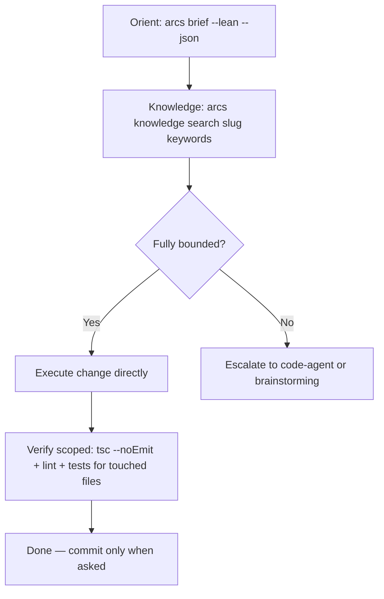

# Skill: quick-dev

## When

Task is fully bounded — no open decisions, success criteria derivable without asking.

## Flow



## Phase 0: Knowledge Check

```bash
arcs knowledge search <slug> "<keywords>" --lean --json
```

Check for patterns, gotchas, and lessons before implementing. Skip only if the change is purely mechanical (rename, config nudge).

## Behaviour

0. Apply `the-ladder` before writing code — climb the rungs (stdlib / native platform / installed dep before new code) and mark deliberate simplifications with `// SHORTCUT:` comments
1. Orient with ARCS context + search if pattern-related
2. Execute directly — no planning doc, no brainstorming, no TDD ritual
3. Scoped verification only — run the dispatch VERIFY command (tests + lint for files you touched). NEVER the full suite. Pervasive change (shared types, config, build) or failures in out-of-scope files → report under BLOCKED_BY, never fix; full-project verification belongs to the devil-advocate completion gate.

## Escalation

If hidden complexity surfaces mid-task — **pause immediately**, state the issue, offer to switch to `code-agent` or `brainstorming`. Do not silently expand scope.

If self-confidence drops below 80% (open decision, unverified assumption, sibling pattern unclear), escalate to `code-agent` — `quick-dev` does not permit exploration loops; `code-agent` does.

## NOT for

- Tasks with open design decisions → `code-agent`
- New behaviour or UX changes → `brainstorming`
