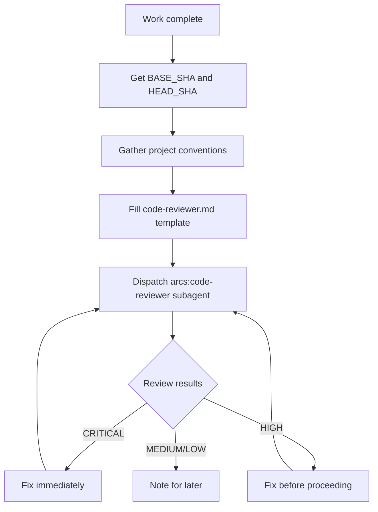

# Skill: requesting-code-review

## When

After completing a task, major feature, or before merge. Dispatch `arcs:code-reviewer` subagent.

## Flow

## Template Placeholders

- `{WHAT_WAS_IMPLEMENTED}` — what you built
- `{PLAN_OR_REQUIREMENTS}` — what it should do
- `{BASE_SHA}` / `{HEAD_SHA}` — commit range
- `{PROJECT_CONVENTIONS}` — CLAUDE.md / linter configs / style guides (gather once per session, reuse across dispatches)

## When to Request

**Mandatory:** after major features, before merge to main.
**Already scheduled:** when `subagent-driven-development` drives the loop, its pipeline dispatches this review as stage 2 (code-quality-reviewer applies this template's checklist but returns the SDD JSON envelope) — do not schedule it twice for the same task.
**Optional:** when stuck, before refactoring, after complex bugfix.

## Red Flags

- Never skip because "it's simple"
- Never ignore CRITICAL findings
- Never proceed with unfixed HIGH findings
- Always include project conventions in reviewer context
- CRITICAL/HIGH fixes route to the owning implementer — never fix files outside your own scope

See template at: `requesting-code-review/code-reviewer.md`

Reviewer returns the unified envelope: STATUS → VERDICT (approve | request-changes | comment-only) → FINDINGS by severity (CRITICAL/HIGH/MEDIUM/LOW) with 📍 file:line anchors.
