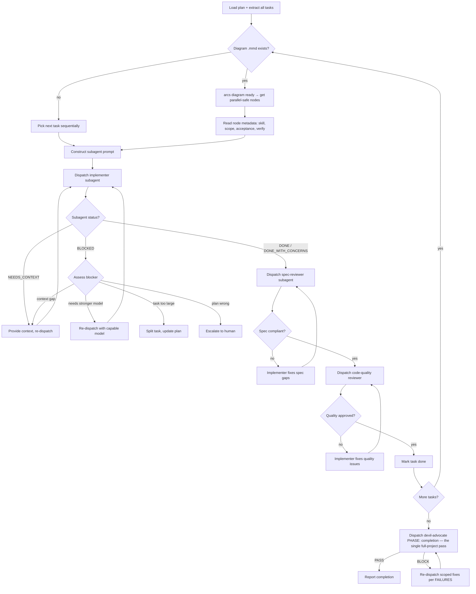
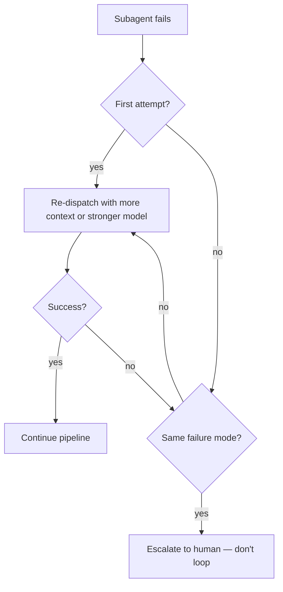

# Skill: Subagent-Driven Development

## When

You have an implementation plan with mostly-independent tasks and want to execute them in-session via fresh subagents with two-stage review.

**NOT for:**
- If no subagent dispatch capability is available → use `executing-plans` instead (single-agent sequential)
- If the work is iterative self-correction without structured plan tasks → use `loop` instead

> CLI Primer: `arcs --commands --json` for discovery. Mutating commands run directly — no token.

## Flow



**Gate cap:** two consecutive completion BLOCKs → stop and escalate to human; never loop the V→X cycle a third time.

**Under the ARCS orchestrator:** the orchestrator's devil-advocate PHASE: execute gate replaces the code-quality reviewer step (the gate runs the scoped VERIFY and the drift check); spec review remains. Running standalone, keep both reviewer stages as drawn.

## Retry & Escalation



## Diagram-First Dispatch

When the plan has a `.mmd` file:

1. `arcs diagram ready <slug> <planId>` → all returned nodes are dispatch-safe in parallel
2. Use per-node `%%` metadata (`skill`, `scope`, `files`, `acceptance`, `verify`) to construct prompts
3. After completion: `arcs task transition <slug> <taskId> done --diagramNodeId=T001 --planId=<planId>`
4. Re-run `diagram ready` to discover newly-unblocked nodes
5. If node metadata is incomplete, fall back to reading the plan body for that task

**Ownership:** Dispatcher owns `.mmd` updates. Implementer subagents MUST NOT edit diagrams.

## Sub-Agent Prompt Construction

Every implementer subagent prompt MUST include:

| Section | Content |
|---------|---------|
| **Goal** | Exact task description from plan (full text, not summary) |
| **Context** | Where this task fits in the plan; what came before |
| **Scope** | File boundaries — what to touch, what NOT to touch |
| **Acceptance** | Done criteria copied verbatim from plan/diagram |
| **Verify** | Exact command to run before claiming done — scoped to the task's files, never the full suite |
| **Skill** | Which work-mode skill to load (from diagram metadata or inferred) |
| **Return** | Structured Return envelope (below) — brief prose findings first, JSON block last |

Do NOT make the subagent read the plan file. Provide full text in the prompt.

## Model Selection

| Task complexity | Model tier |
|----------------|-----------|
| 1-2 files, clear spec, mechanical | Fast/cheap |
| Multi-file integration, pattern matching | Standard |
| Architecture, design, review | Most capable |

## Prompt Templates

- `./implementer-prompt.md`
- `./spec-reviewer-prompt.md`
- `./code-quality-reviewer-prompt.md`

## Structured Return

All sub-agents MUST return a JSON block as the LAST thing in their message — brief prose findings first, JSON block last, nothing after it:

```json
{
  "status": "DONE | DONE_WITH_CONCERNS | BLOCKED | NEEDS_CONTEXT",
  "summary": "<1-2 sentences>",
  "payload": { "<role-specific fields per prompt template>": "..." }
}
```

Role payloads: implementer → `filesChanged`/`filesCreated`/`verification{command,result,scopeReason}`/`concerns`/`scopeChanges`; spec reviewer → `compliant`/`issues`; quality reviewer → `approved`/`issues`.
Orchestrator parses `status` for routing, `payload` for action.
Mapping to the orchestrator's Standard Return Envelope: DONE→done, DONE_WITH_CONCERNS→done + concerns surfaced, BLOCKED→blocked, NEEDS_CONTEXT→blocked.

Include in every dispatch prompt:
> "Return format: brief prose findings first, then the JSON envelope (status + typed payload) from your role's prompt template as the LAST thing in your message — nothing after it."

## Git State Discipline

- Sub-agents MUST NOT run `git stash` — ever, under any circumstance
- Sub-agents MUST NOT run `git checkout` on shared branches
- Sub-agents commit their changes atomically (scoped to task files) before reporting back
- Other agents may be working concurrently — do not assume a clean worktree
- Use `git diff HEAD -- <your-files>` to verify YOUR changes only — bare `git diff` is unreliable in parallel
- If you see unexpected changes in files outside your scope: **ignore them** — they belong to another agent

## Verification Scoping

Sub-agents lint and test **only files they touched**:

| Scope | Command | NOT this |
|-------|---------|----------|
| Lint | `biome check src/changed.ts` | `biome check .` |
| Test | `vitest run test/changed.test.ts` | `vitest run` / `npm test` |
| Type check | `tsc --noEmit` — read-only signal; out-of-scope errors are report-only | fixing type errors outside your scope |

Sub-agents NEVER run the full suite — not even for pervasive changes. If a change is pervasive
(shared types, config, build), record it in `scopeChanges`/`concerns`; the orchestrator defers
full-project verification to the devil-advocate completion gate. Type errors or test failures in
files outside your scope are report-only — never fix them; the authoritative project-wide tsc run
belongs to that gate. Sub-agent must state `scopeReason` in return payload.

## Parallelism Rules

Parallel implementers are allowed when tasks touch **zero shared files**.

1. **Independence check:** Orchestrator verifies no file overlap before dispatch. If overlap → serialize.
2. **Batch limit:** Maximum 4 concurrent subagents per round. Queue remaining.
3. **Prompt construction:** Per the Sub-Agent Prompt Construction table above — all rows required.
4. **Conflict detection:** After fan-out completes, check for conflicting edits before committing.
5. **Shared context:** Fetch once (e.g., project brief), inject into all subagent prompts — don't make each agent re-fetch.

**When to serialize instead:**
- Tasks share source files (even different functions in same file)
- Task B's approach depends on Task A's output
- Both tasks modify test fixtures or shared mocks

## Constraints

- Fresh subagent per task — never reuse session context
- Spec review BEFORE code quality review (never reverse)
- Parallel implementers only when zero file overlap (orchestrator verifies)
- Never skip re-review after fixes
- Never ignore BLOCKED/NEEDS_CONTEXT status — something must change
- Never start on main/master without explicit user consent
- If reviewer finds issues → implementer fixes → reviewer re-reviews → repeat until approved
- DONE_WITH_CONCERNS: read concerns before proceeding; address if correctness/scope related
- Scope changes discovered by subagents: report in summary, dispatcher handles diagram regeneration
