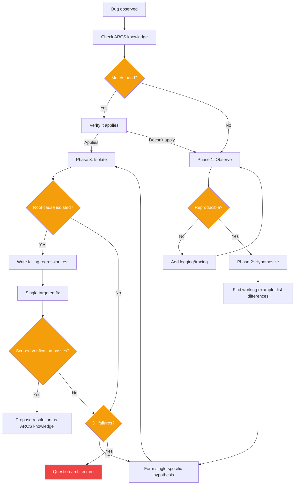

# Skill: systematic-debugging

## When

Any bug, test failure, or unexpected behavior — before proposing fixes.

> Follows ARCS CLI Primer: `arcs --commands --json` for discovery, `--json --lean` on all calls.

## Flow



## Phase 1: Observe (Root Cause Investigation)

- Read the actual error message completely
- Reproduce consistently before proceeding
- Check recent changes (`git log`, `git diff`)
- Trace data flow backward from failure point
- Instrument component boundaries if cause unclear
- **Pre-step:** `arcs knowledge search <slug> "<error>" --json` for gotcha/lesson/pattern entries

## Phase 2: Hypothesize (Pattern Analysis)

- Find a working example in the same codebase
- Compare working vs broken — list every difference
- Understand the dependency chain
- Form ONE specific hypothesis (not multiple)

## Phase 3: Root Cause Isolation

- Test the hypothesis with the smallest possible diagnostic change
- One variable at a time — never stack fixes
- If hypothesis fails, form a new one from evidence
- Do not proceed until the evidence isolates the root cause
- **Escalation:** 3+ failed fixes → question the architecture, not the symptom

## Phase 4: Fix

- Write a failing regression test FIRST (proves the bug exists and prevents a fix-before-test path)
- Implement a single targeted fix
- Run scoped verification for the files you changed (your dispatch VERIFY command — never the full suite; the devil-advocate completion gate owns that)
- Prepare the resolution as an ARCS knowledge proposal after verification passes; do not execute `arcs knowledge upsert`
- If your fix introduces new failures in YOUR scoped tests, revert and return to Phase 2. Failures in files outside your scope are report-only (BLOCKED_BY) — likely a sibling agent's in-flight work; never fix or revert it

## Log Triage Protocol

**Scan order:** failure point → errors → warnings → timing anomalies

```bash
rg -n "ERROR|FATAL|panic|exception" <logfile>   # Error grep
jq 'select(.level == "error")' <json-log>       # Structured logs
```

**Output:** Timeline of events leading to failure (T-5m, T-3m, T-0).

## Git Bisect (Regressions)

```bash
git bisect start
git bisect bad HEAD
git bisect good <last-known-good>
git bisect run <test-command>
```

After finding the commit: read the diff, isolate specific lines, feed into Phase 2.

## Dependency Conflict Diagnosis

| Symptom | Likely Cause |
|---------|-------------|
| `instanceof` fails across modules | Duplicate package copies |
| Type mismatch on same interface | Different versions loaded |
| "Cannot find module" intermittent | Hoisting conflict |
| Works with `--legacy-peer-deps` | Peer dep unsatisfied |

Diagnose: `npm ls <pkg>`, `npm explain <pkg>`, check for multiple copies.

## ARCS Knowledge Capture

After root cause identification, propose durable knowledge for orchestrator fan-in persistence:
- **gotcha** — environmental/config traps
- **lesson** — architectural insights from this session
- **pattern** — reusable solution to recurring problem

Include: root cause summary, evidence, affected files, fix approach.

### Propose Resolution as Knowledge

After resolving the issue, choose the kind and obtain its required anatomy before authoring a complete entry:

```bash
arcs knowledge template --kind=gotcha --json
# Fill every returned section with observed evidence, affected files, and the fix approach.
arcs knowledge upsert <slug> "<specific debugging discovery>" \
  --kind=gotcha --summary="<durable takeaway>" --body-file=<complete-body.md> \
  --keywords="<error,component,root-cause>" --source-files=<affected-paths> --json
```

Return that command as a ready-to-run proposal. Do not execute `arcs knowledge upsert`; the orchestrator owns fan-in persistence. Use the same template-first flow for `lesson` and `pattern`; do not copy a body-shaped example that omits the selected kind's required sections.

**Kind selection guide:**
- `gotcha` — surprising behavior, trap, or non-obvious failure mode
- `lesson` — learned technique, debugging approach, resolution method
- `pattern` — reusable solution that should be applied going forward

## Constraints

- **NO FIXES WITHOUT ROOT CAUSE INVESTIGATION.** If Phase 1 incomplete, you cannot propose fixes.
- **One variable at a time.** Never apply multiple changes simultaneously.
- **3+ failures = architectural problem.** Stop fixing symptoms, question the pattern.
- **Test before fix.** Failing test proves the bug; green test proves the fix.
- **Defense in depth:** After fixing root cause, add validation at multiple layers to prevent recurrence.
- **Systematic is faster than thrashing.** 15-30min systematic vs 2-3h random fixes.

## Red Flags (Return to Phase 1)

- "Quick fix for now, investigate later"
- "Just try changing X and see"
- Proposing solutions before tracing data flow
- Each fix reveals a new problem in a different place
- "I don't fully understand but this might work"
- Human says "stop guessing" or "is that not happening?"
