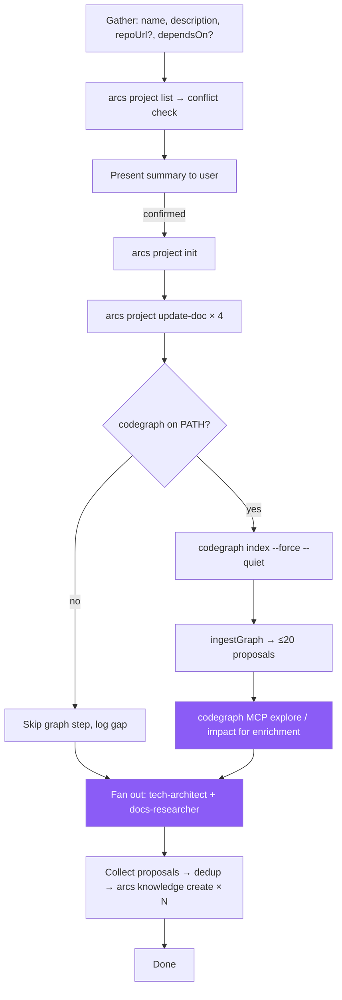

> **Canonical source:** `src/cli/arcs-orchestrate.ts` under `### INIT Workflow`.

## When

User wants to track a new project, bootstrap documentation, or connect a repo to the DAG.

## Flow



## CLI Primer

```bash
arcs <command> --json
```
Discovery: `arcs --commands --json`

## Constraints

- Do NOT read repo to infer name/description — gather from user
- Verify `dependsOn` targets exist via `arcs project list --json`
- Init creates empty plans/ and knowledge/ indexes
- Repo analysis is **fan-out across typed agents**, not a generic "analysis sub-agent" (see Agent Dispatch table below)

## Codegraph Sub-Flow (DEFAULT: ON when binary present)

The orchestrator runs codegraph directly during INIT to produce structural **proposals** before any sub-agent reads code. Proposals land on the proposal-store ledger (`pending_enrichment: true`); agents enrich them into knowledge entries via the `enriching-codegraph-proposals` skill.

1. **Detect:** `detectCodegraph()` from `src/utils/codegraph.ts`. If unavailable, skip cleanly — never block INIT on codegraph.
2. **Trust the gitignore guarantee:** `runIndex()` already auto-appends `.codegraph/` to `.gitignore` (`ensureGitignoreEntry`). Don't redundantly check or modify `.gitignore` from agents — running the index is sufficient.
3. **Index (AST-based; CLI drives the bundled runtime, no LLM key required):**
   ```bash
   codegraph index <workspacePath> --force --quiet
   ```
   Builds a per-project SQLite index under `<workspacePath>/.codegraph/`. There is no `graph.json` artifact.
4. **Ingest:** `arcs project init` internally calls `ingestGraph(workspacePath, slug)` → up to 20 `KnowledgeProposal` records written to `proposals/graphify.json` (filename retained for compatibility; rename pending; test files filtered):
   - 8 god nodes (`kind=module`, ranked by callers+callees / impact)
   - 8 architecture clusters (`kind=architecture`, synthesized pseudo-communities by directory prefix)
   - 5 cross-module couplings (`kind=gotcha`, high-degree links across top-level dirs)
5. **Enrich** with the `enriching-codegraph-proposals` skill — read `arcs proposal list <slug> --json`, decide per-proposal verdicts (keep / merge / drop), persist via `arcs proposal promote` and `arcs proposal drop`. Sub-agents may run read-only codegraph MCP queries for evidence (the MCP server auto-syncs via its own file watcher):
   - `codegraph_search "entry points and main commands"` → seeds for "key files" reference entries
   - `codegraph_explore` on core modules → seeds for "core modules" entries
   - `codegraph_node "<godNodeLabel>"` → structural summary for module entry bodies
   - `codegraph_impact "<critical-symbol>"` → reverse-impact map for high-risk modules
   - `codegraph_callers` / `codegraph_callees "<symbol>"` → dependency paths for architecture entries
6. **Hand to typed agents:** the proposals + query results go to the sub-agents listed in **Agent Dispatch** below; they merge graph evidence with code reading and return finalized knowledge entries.
7. **Write** the entries directly via `arcs batch --file=ops.json` (one batch invocation for all knowledge entries) or `arcs knowledge create` per entry.

If codegraph is missing, log "codegraph not on PATH; proceeding without graph signal" and skip steps 3–5. Sub-agents still run; they just lack the graph priors.

## Content Guidelines

| Doc | Format |
|-----|--------|
| overview.md | 2-3 sentence summary + goals |
| tasks.md | `[ ]` backlog / `[/]` in-progress / `[x]` done |
| dependencies.md | Upstream + downstream sections |
| knowledge.md | High-level context + pointers to structured entries |

## Agent Dispatch (named typed agents — DO NOT default to a generic analysis agent)

| Sub-agent | Owns | Knowledge kinds it produces |
|-----------|------|----------------------------|
| `tech-architect` | Module boundaries, clusters, dependency direction, cross-module couplings, structural gotchas, lessons | `architecture`, `module`, `gotcha`, `lesson` |
| `docs-researcher` | Tech stack, third-party libraries, key files, features | `reference`, `feature` |
| `code-reviewer` (audit mode, optional) | Coding-style + convention scan from existing code | `pattern` |

Dispatch in parallel. Each agent receives the relevant `KnowledgeProposal` records from `ingestGraph` plus targeted codegraph MCP queries for evidence. Each agent returns finalized proposals (title, kind, summary, keywords, sourceFiles, body) for the orchestrator to write directly via `arcs knowledge create` (or `arcs batch`).

## Knowledge Categories for Analysis Sub-Agents

| Category | Kind | What to discover | Primary agent |
|----------|------|------------------|---------------|
| tech stack | `architecture` | Languages, frameworks, runtimes, build tools, versions | `docs-researcher` |
| key files | `reference` | Entry points, config files, main modules, purposes | `docs-researcher` (codegraph_search "entry points") |
| code patterns | `pattern` | Recurring design patterns, abstractions, error handling | `code-reviewer` (audit mode) or `tech-architect` |
| coding style | `pattern` | Formatting, linting, import ordering, file organization | `code-reviewer` (audit mode) |
| core modules | `module` | Core modules/shared functions — what, where, interconnections | `tech-architect` (god nodes from codegraph) |
| external services | `module` | APIs, databases, message queues the project interacts with | `docs-researcher` |
| third-party libraries | `reference` | Key dependencies and why they are used | `docs-researcher` |
| features | `feature` | Major user-facing or system-facing features | `docs-researcher` |
| cross-module couplings | `gotcha` | Hot edges between modules surfaced by codegraph | `tech-architect` (auto from `ingestGraph`) |
| architecture clusters | `architecture` | Pseudo-community/directory groupings from codegraph | `tech-architect` (auto from `ingestGraph`) |
