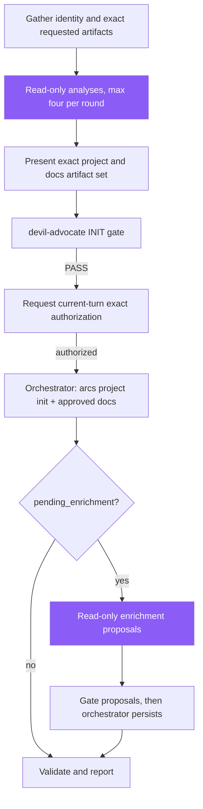

> **Canonical source:** `src/cli/arcs-orchestrate.ts` under `### INIT Workflow`.

## When

User wants to track a new project, bootstrap documentation, or connect a repo to the DAG.

## Flow



## CLI Primer

```bash
arcs <command> --json
```
Discovery: `arcs --commands --json`

## Constraints

- Gather project identity and requested artifact scope from the user; repository analysis supplies evidence, not authority
- Verify `dependsOn` targets exist via `arcs project list --json`
- Init creates empty plans/ and knowledge/ indexes
- Repo analysis is read-only fan-out across typed agents, with at most four disjoint analyses per round
- No durable write occurs before the INIT gate passes and the user authorizes the exact artifact set in the current turn
- Plans, tasks, and diagrams use the separate HITL design pipeline: `brainstorming` design approval, then `writing-plans` as sole author, gate, and exact-revision authorization
- No automatic git actions; add, commit, and push require an explicit current-turn user request

## Codegraph Sub-Flow (DEFAULT: ON when binary present)

`arcs project init` uses codegraph when available and degrades cleanly when it is absent. Ingestion creates structural **proposals**, not accepted knowledge. If init reports `pending_enrichment: true`, the orchestrator dispatches the read-only `enriching-codegraph-proposals` skill and persists only proposals that pass their owning gate.

1. **Detect:** `detectCodegraph()` from `src/utils/codegraph.ts`. If unavailable, skip cleanly — never block INIT on codegraph.
2. **Trust the gitignore guarantee:** `runIndex()` already auto-appends `.codegraph/` to `.gitignore` (`ensureGitignoreEntry`). Don't redundantly check or modify `.gitignore` from agents — running the index is sufficient.
3. **Index (AST-based; CLI drives the bundled runtime, no LLM key required):**
   ```bash
   codegraph index <workspacePath> --force --quiet
   ```
   Builds a per-project SQLite index under `<workspacePath>/.codegraph/`. There is no `graph.json` artifact.
4. **Ingest:** `arcs project init` internally calls `ingestGraph(workspacePath, slug)` → up to 20 `KnowledgeProposal` records written to `proposals/graphify.json` (filename retained for compatibility; rename pending; test files filtered):
   - 8 god nodes (`kind=module`, ranked by callers+callees / impact)
   - 8 architecture clusters (`kind=architecture`, synthesized pseudo-communities by directory prefix)
   - 5 cross-module couplings (`kind=gotcha`, high-degree links across top-level dirs)
5. **Enrich read-only** with the `enriching-codegraph-proposals` skill — read `arcs proposal list <slug> --json` and return exact keep / merge / drop proposed mutations. Sub-agents may run read-only codegraph MCP queries for evidence:
   - `codegraph_search "entry points and main commands"` → seeds for "key files" reference entries
   - `codegraph_explore` on core modules → seeds for "core modules" entries
   - `codegraph_node "<godNodeLabel>"` → structural summary for module entry bodies
   - `codegraph_impact "<critical-symbol>"` → reverse-impact map for high-risk modules
   - `codegraph_callers` / `codegraph_callees "<symbol>"` → dependency paths for architecture entries
6. **Gate:** `devil-advocate` reviews the exact enrichment proposal.
7. **Persist after PASS:** the orchestrator applies only the gated proposal operations. Workers never write knowledge directly.

If codegraph is missing, log "codegraph not on PATH; proceeding without graph signal" and skip steps 3–5. Sub-agents still run; they just lack the graph priors.

## Content Guidelines

| Doc | Format |
|-----|--------|
| overview.md | 2-3 sentence summary + goals |
| tasks.md | `[ ]` backlog / `[/]` in-progress / `[x]` done |
| dependencies.md | Upstream + downstream sections |
| knowledge.md | High-level context + pointers to structured entries |

## Agent Dispatch (named typed agents — DO NOT default to a generic analysis agent)

| Sub-agent | Owns | Knowledge kinds it produces |
|-----------|------|----------------------------|
| `tech-architect` (`AGENT_MODE: architecture`) | Module boundaries, clusters, dependency direction, cross-module couplings, structural gotchas, lessons | `architecture`, `module`, `gotcha`, `lesson` |
| `tech-architect` (`AGENT_MODE: research`) | Tech stack, third-party libraries, key files, features | `reference`, `feature` |
| `code-reviewer` (audit mode, optional) | Coding-style + convention scan from existing code | `pattern` |

Dispatch only disjoint read-only analyses in parallel, with a maximum of four agents per round. Each agent receives relevant graph evidence and returns proposals; persistence remains with the orchestrator after the owning gate passes.

## Knowledge Categories for Analysis Sub-Agents

| Category | Kind | What to discover | Primary agent |
|----------|------|------------------|---------------|
| tech stack | `architecture` | Languages, frameworks, runtimes, build tools, versions | `tech-architect` (`AGENT_MODE: research`) |
| key files | `reference` | Entry points, config files, main modules, purposes | `tech-architect` (`AGENT_MODE: research`; codegraph_search "entry points") |
| code patterns | `pattern` | Recurring design patterns, abstractions, error handling | `code-reviewer` (audit mode) or `tech-architect` |
| coding style | `pattern` | Formatting, linting, import ordering, file organization | `code-reviewer` (audit mode) |
| core modules | `module` | Core modules/shared functions — what, where, interconnections | `tech-architect` (god nodes from codegraph) |
| external services | `module` | APIs, databases, message queues the project interacts with | `tech-architect` (`AGENT_MODE: research`) |
| third-party libraries | `reference` | Key dependencies and why they are used | `tech-architect` (`AGENT_MODE: research`) |
| features | `feature` | Major user-facing or system-facing features | `tech-architect` (`AGENT_MODE: research`) |
| cross-module couplings | `gotcha` | Hot edges between modules surfaced by codegraph | `tech-architect` (auto from `ingestGraph`) |
| architecture clusters | `architecture` | Pseudo-community/directory groupings from codegraph | `tech-architect` (auto from `ingestGraph`) |
