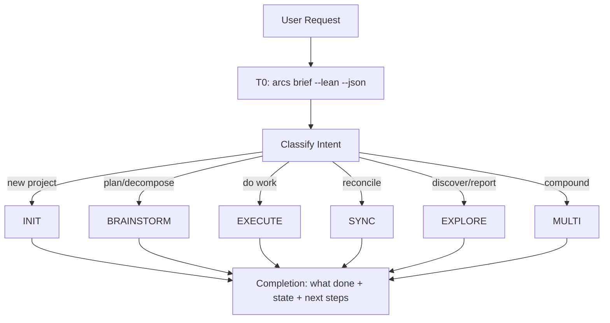

> **Canonical source:** `src/cli/arcs-orchestrate.ts` (`ORCHESTRATE_PROMPT_TEXT`).
> This is a condensed summary. TS prompt wins on disagreement.

## When

User request maps to multiple workflows, needs routing, or chains INIT → BRAINSTORM → EXECUTE.

## Flow



## Context Tiers

| Tier | What | Who |
|------|------|-----|
| **T0** | `arcs brief --lean --json` — routing surface, focus, next action | Orchestrator |
| **T1** | Single doc fetch | Sub-agent (default) |
| **T2** | Index listings | Sub-agent (default) |
| **T3** | Full body read | Sub-agent always |
| **T4** | Multi-doc / audit | Sub-agent always |

**Cardinal rule:** Orchestrator reads T0 + writes. Sub-agents read everything else.

### T0 envelope shape

`arcs brief --json` returns a tight ~1 KB envelope:

```json
{
  "slug": "...", "name": "...", "summary": "...",
  "operatingBrief": {
    "currentFocus":       "<task or plan title to anchor on>",
    "recommendedSurface": "QUEUE | PLAN | MEMORY",
    "why":                "<one-line rationale>",
    "nextAction":         "<concrete next step the orchestrator should take>"
  },
  "activePlansCount": N, "activePlanTitles": [...],
  "openTasksCount":   N, "topOpenTasks": [{ id, title, status }],
  "topKnowledge":     [{ id, title, kind }]
}
```

Use `recommendedSurface` to pick the routing branch:
- `QUEUE` → execute the active task (EXECUTE workflow)
- `PLAN`  → decompose or plan work (BRAINSTORM workflow)
- `MEMORY` → no active work; review knowledge or propose a new plan

## CLI Primer

All ops: `arcs <group> <action> [args] --json`. Mutating commands run directly — no token:
```bash
arcs <command> --json
```
Discovery: `arcs --commands --json`

## Skill Selection (EXECUTE)

| Task shape | Skill |
|-----------|-------|
| Fully bounded | `quick-dev` |
| Mostly clear, 1-2 open questions | `code-agent` |
| Non-trivial, test-first | `test-driven-development` |
| Design open | reclassify → BRAINSTORM |

## Loop Tools

- `arcs loop start <slug> --prompt="..." --session="<session-id>" --max-iterations=50 --json` — self-referential dev loop (--session is required; use a unique stable ID per agent session, e.g. a UUID or timestamp string)
- `arcs loop cancel <slug> --json` — cancel active loop
- `arcs loop status <slug> --json` — inspect loop state

Use these `arcs loop` session commands only when iterative execution is explicitly needed; otherwise route work through the selected execution skill.

## Verification Contract

- Sub-agents run ONLY the scoped VERIFY command from their dispatch (tests/lint on files they touched) — never the full suite.
- The orchestrator never verifies: no tests, lint, builds, or `tsc`.
- `devil-advocate` PHASE: completion is the session's single full-project pass (full suite + `tsc --noEmit`); on BLOCK, re-dispatch scoped fixes from its FAILURES attribution and re-gate. Two consecutive BLOCKs → stop, report.

## Completion

Every session ends with:
1. Gate — if any agent reported FILES_TOUCHED ≠ none, dispatch `devil-advocate` PHASE: completion (the only full-project verification); BLOCK → fix loop; never claim done before PASS. Zero-file-change sessions skip the gate.
2. What was done
3. Current project state
4. Suggested next steps
