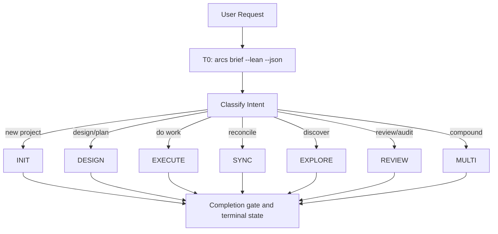

> **Canonical source:** `src/cli/arcs-orchestrate.ts` (`ORCHESTRATE_PROMPT_TEXT`).
> This is a condensed summary. TS prompt wins on disagreement.

## When

User request needs routing through INIT, DESIGN, EXECUTE, SYNC, EXPLORE, REVIEW, or MULTI.

## Flow



## Context Tiers

| Tier | What | Who |
|------|------|-----|
| **T0** | `arcs brief --lean --json` — routing surface, focus, next action | Orchestrator |
| **T1** | Single doc fetch | Sub-agent (default) |
| **T2** | Index listings | Sub-agent (default) |
| **T3** | Full body read | Sub-agent always |
| **T4** | Multi-doc / audit | Sub-agent always |

**Cardinal rule:** Orchestrator reads T0 + writes. Sub-agents read everything else.

### T0 envelope shape

`arcs brief --json` returns a tight ~1 KB envelope:

```json
{
  "slug": "...", "name": "...", "summary": "...",
  "operatingBrief": {
    "currentFocus":       "<task or plan title to anchor on>",
    "recommendedSurface": "QUEUE | PLAN | MEMORY",
    "why":                "<one-line rationale>",
    "nextAction":         "<concrete next step the orchestrator should take>"
  },
  "activePlansCount": N, "activePlanTitles": [...],
  "openTasksCount":   N, "topOpenTasks": [{ id, title, status }],
  "topKnowledge":     [{ id, title, kind }]
}
```

Use `recommendedSurface` to pick the routing branch:
- `QUEUE` → execute the active task (EXECUTE workflow)
- `PLAN`  → design or plan work (DESIGN workflow)
- `MEMORY` → no active work; review knowledge or propose a new plan

## CLI Primer

All ops: `arcs <group> <action> [args] --json`. Mutating commands run directly — no token:
```bash
arcs <command> --json
```
Discovery: `arcs --commands --json`

## Agent and Skill Routes

| Agent | AGENT_MODE | Route |
|-------|------------|-------|
| `software-engineer` | `default` | Implementation with orchestrator-selected `WORK_MODE: bounded` or `inspect`; load `implementation` |
| `software-engineer` | `incident` | Diagnosis-first work; add mandatory `systematic-debugging` |
| `tech-architect` | `architecture` | Read-only design with `brainstorming`, then `writing-plans` only after design approval |
| `tech-architect` | `research` | DAG-first cited research; use `writing-knowledge` for substantive proposals |
| `graph-explorer` | `default` | DAG-first repository facts, dependencies, and bounded source questions |
| `code-reviewer` | `review` / `audit` | Reactive diff/PR review or proactive scope/architecture audit |
| `devil-advocate` | phase name | Mandatory phase and completion gates |
| `arcs-docs` | `audit` / `apply` | Two-pass SYNC only |

The twelve skills are `implementation`, `test-driven-development`, `executing-plans`, `systematic-debugging`, `brainstorming`, `writing-plans`, `to-diagram`, `writing-knowledge`, `init-project`, `enriching-codegraph-proposals`, `deep-pr-review`, and `caveman-commit`.

`WORK_MODE: bounded` means no repository exploration or user questions. `WORK_MODE: inspect` permits limited inspection to resolve at most one material decision. Add `test-driven-development` for new behavior or bug fixes, and add `executing-plans` only for one approved plan node.

## Workflow Contracts

- **DESIGN:** `brainstorming` produces a read-only design. After the user approves it, `writing-plans` is the sole author of the complete exact plan, task, dependency, verification, and diagram draft. `devil-advocate` gates that draft before exact current-turn authorization and persistence.
- **SYNC:** exactly two-pass — `arcs-docs` `audit` returns exact proposed mutations; `devil-advocate` gates them; only then may `arcs-docs` `apply` the approved mutations and validate the DAG.
- **EXPLORE:** use DAG-first retrieval. If the DAG cannot answer, dispatch `graph-explorer` for codegraph or bounded source fallback.
- **Git:** no automatic git actions. Run add, commit, or push only after an explicit current-turn user request naming the action.

## Loop Tools

- `arcs loop start <slug> --prompt="..." --session="<session-id>" --max-iterations=50 --json` — self-referential dev loop (--session is required; use a unique stable ID per agent session, e.g. a UUID or timestamp string)
- `arcs loop cancel <slug> --json` — cancel active loop
- `arcs loop status <slug> --json` — inspect loop state

Use these `arcs loop` session commands only when iterative execution is explicitly needed; otherwise route work through the selected execution skill.

## Verification Contract

- Sub-agents run ONLY the scoped VERIFY command from their dispatch (tests/lint on files they touched) — never the full suite.
- The orchestrator never verifies: no tests, lint, builds, or `tsc`.
- `devil-advocate` PHASE: completion is the session's single full-project pass (`npm test`, `npm run typecheck`, and `npm run lint`); on BLOCK, re-dispatch scoped fixes from its FAILURES attribution and re-gate. Two consecutive BLOCKs → stop, report.

## Completion

Every session ends with:
1. Gate — if any agent reported FILES_TOUCHED ≠ none, dispatch `devil-advocate` PHASE: completion (the only full-project verification); BLOCK → fix loop; never claim done before PASS. Zero-file-change sessions skip the gate.
2. What was done
3. Current project state
4. Suggested next steps
