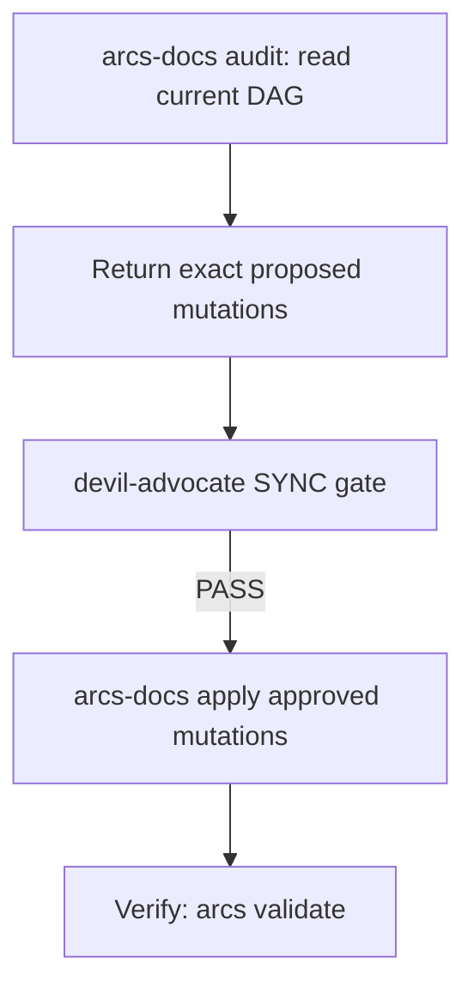

> **Canonical source:** `src/cli/arcs-orchestrate.ts` `## Content Guidelines`.

## When

Codebase analyzed and findings need recording, task statuses changed, dependencies updated, or knowledge needs capturing.

## Flow



## CLI Primer

```bash
arcs <command> --json
```
Discovery: `arcs --commands --json`

## Content Guidelines

| Doc | Format |
|-----|--------|
| overview | 2-3 sentence summary + concrete goals |
| tasks | `[ ]` backlog / `[/]` in-progress / `[x]` done — execution queue state only |
| dependencies | Upstream + downstream with notes on *why* |
| knowledge | Summary landing page → point to structured knowledge entries |

## Structured Plans for Feature Work

Use structured plans for feature work that spans multiple tasks. `brainstorming` produces the approved design; `writing-plans` is the sole authoring owner for the complete exact plan/task/diagram draft. The orchestrator persists that exact revision only after the plan gate passes and the user gives current-turn exact-artifact authorization.

List existing: `arcs plan list <slug> --json`

## Structured Knowledge Entries

For durable project memory (lessons, gotchas, patterns, architecture), workers return proposal-only `arcs knowledge upsert` commands. The orchestrator applies them only after their owning phase passes.

List existing: `arcs knowledge list <slug> --json`

| Section | What to include |
|---------|----------------|
| Tech Stack | Languages, frameworks, runtimes, key libraries |
| Architecture | Module boundaries, service topology, data flow |
| Patterns | Naming conventions, file organization, coding patterns |
| Gotchas | Non-obvious behaviors, common pitfalls, workarounds |
| Key Files | Entry points, config files, main modules |

> **Tip**: Summary table in knowledge.md. Deep dives in knowledge entries.

SYNC is strictly two-pass (`audit` then approved `apply`). There are no automatic git actions.

## Plan Keyword Conventions

| Keywords | Status | Origin |
|----------|--------|--------|
| `spec`, `design` | `proposed` | Design specs from brainstorming |
| `implementation-plan` | `planned` | Step-by-step implementation plans |
